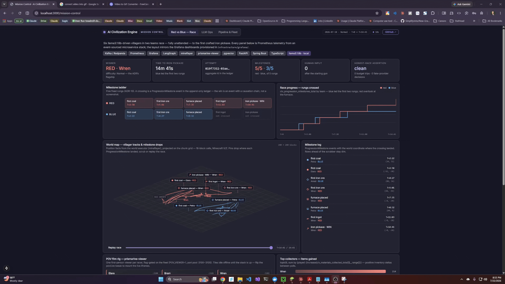

# Minecraft AI Agents

[](https://github.com/parkershamblin/ai-civilization-engine/actions/workflows/events-contracts.yml)
[](https://github.com/parkershamblin/ai-civilization-engine/actions/workflows/event-service.yml)
[](https://github.com/parkershamblin/ai-civilization-engine/actions/workflows/minecraft-service.yml)
[](https://github.com/parkershamblin/ai-civilization-engine/actions/workflows/agent-service.yml)
[](https://github.com/parkershamblin/ai-civilization-engine/actions/workflows/government-service.yml)
[](https://github.com/parkershamblin/ai-civilization-engine/actions/workflows/dashboard.yml)


https://github.com/user-attachments/assets/a3d88897-b511-492a-a945-c490e3a3feaa


[](film/mission-control-plus-rb-race-demo-1.mp4)


Autonomous LLM-driven villagers live inside Minecraft. **Current arc: Red vs
Blue** ([ADR-10](docs/architecture/10-red-vs-blue.md)) — two teams of three
race, fully unattended, to the first crafted iron pickaxe: local llama
deliberates every 10–20 seconds, the body executes survival reflexes and tool
chains, and every milestone is judged from an append-only event ledger (the
win is a ledger event with a causation chain, not a screenshot). The earlier
civilization arc — personalities, memories, relationships, elections — is
intact and mothballed behind a compose profile. Every action is an immutable
event; the event stream is the integration seam between services, the source
of truth for analytics, and the raw material for the video series.
Live scoreboard: `http://localhost:3000/race` · Mission Control:
`http://localhost:3000/mission-control`.

**The race has been won — Easy, Normal, and Normal with hostile mobs.**
First honest 3v3 completion 2026-07-18: red's Elara crafted the iron pickaxe
in **6 minutes 0.4 seconds** (Easy). The ADR's flagship difficulty fell the
same day: **Normal in 14m41s** (red's Wren, attempt `019f7352-03ae…`, blue
led the first two rungs), then **Normal with mobs in 11m 0.6s** (attempt
`019f744d…`, filmed) with threat reflexes holding — zero deaths. Six
llama3.1:8b-driven villagers, zero human intervention after the starting
gun, every rung a ledger event, honest-race assertion clean every time
(zero token-budget trips, zero fake-provider decisions).
Replay the first win's receipt:

```sh
curl "localhost:8081/events?aggregate-type=Attempt&aggregate-id=019f7337-977e-738e-8d5a-bf8e1db77439"
```

One command runs a fresh race end-to-end, preflight checklist included:
`node scripts/race-rb2.mjs --label my-race` (add `--difficulty normal`,
`--mobs` for hostiles). Film rig: `film/pov-grid.html` + `POV_VIEWER=1`.

**The architecture package lives in [docs/architecture/](docs/architecture/00-system-overview.md)** —
system overview, DDD domain model, database DDL, Kafka/event design, API design,
repo/DevOps layout, and the milestone roadmap.

## Quickstart

Prerequisites:

- **Docker Desktop** (WSL2 backend) — the whole backbone runs in Compose
- **Node 22+**, **go-task** (`winget install Task.Task`)
- Optional: **Ollama** with `llama3.1:8b` + `nomic-embed-text` pulled
  (the LLM chain degrades openai → ollama → fake; blank API key is fine)

```sh
cp .env.example .env        # fill OPENAI_API_KEY or leave blank for Ollama
npm install                 # workspace deps — the smoke canary needs them
task up                     # infra: Postgres+pgvector, Redis, Redpanda, Prometheus, Grafana
```

The bots need a Minecraft 1.21.6 server on `:25565`. Pick one:

- **Containerized PaperMC (zero setup — the fresh-clone path):** set
  `MC_HOST=minecraft` in `.env`, then
  ```sh
  docker compose -f infrastructure/docker/docker-compose.yml --env-file .env --profile minecraft up -d --wait minecraft
  ```
- **Your own host-run server** (`online-mode=false`): keep the
  `MC_HOST=host.docker.internal` default and have it listening first.

```sh
task smoke                  # canary: one bot connects to the MC server and chats
task up:all                 # + the app services: agent, memory, minecraft, event ledger
task seed                   # provision the first VILLAGER_COUNT villagers, spawn bots, start tick loops
```

Proof of life (first deliberation lands within `TICK_INTERVAL_SECONDS`, default 60s):

```sh
docker exec ai-civilization-engine-minecraft-1 rcon-cli list   # the villager is embodied in-world
curl -N localhost:8081/events/stream                           # live ledger feed: decisions, moves, chat
```

(For paged history, `GET :8081/events` always returns oldest-first — pass
`?since=<ISO timestamp>` for anything recent.)

Consoles once `task up` is green: Redpanda console `:8085`, Grafana `:3001`
(admin/admin), Prometheus `:9090`. The Next.js dashboard is host-run **by
design** (#78): `task dashboard` serves it on `:3000` with fast HMR — compose
stays backend-only.

## Layout

```
apps/dashboard/        Next.js dashboard + live SSE feed
services/              the microservices (see docs/architecture/00-system-overview.md):
                         agent-service        Python/FastAPI — villager tick loop (LangGraph)
                         memory-service       Python/FastAPI — pgvector memory stream
                         minecraft-service    Node/TS — the single world executor (mineflayer)
                         event-service        Java/Spring — append-only event ledger + SSE
                         government-service   Java/Spring — elections & governments
packages/events/       JSON Schema event contracts — single source of truth
infrastructure/        docker compose, prometheus/grafana config
experiments/           archived PoCs — the empirically-proven mineflayer version pin
docs/architecture/     the full design package (00–10)
scripts/               repo-level utilities (smoke canary, fleet spawn/despawn)
```

## Status

**Milestone 1 (walking skeleton) — complete.** Event contracts + codegen,
event-service ledger with read API and SSE, minecraft-service bot host and
command executor, pgvector memory, the LLM provider chain, the LangGraph tick
loop, and the Next.js dashboard — a full perceive→deliberate→act→reflect loop
with observability ([demo](docs/demo-sprint-1.md), [M1 demo](docs/demo-m1.md)).

**Milestone 2 (governance) — complete and merged.** government-service owns the
clock-driven election state machine and idempotent ballot box; villagers
nominate, campaign, and vote through the ledger. Mayor Bram is seated and the
fleet is ticking ([M2 plan](docs/architecture/08-m2-plan.md),
[M2 demo](docs/demo-m2.md)).

**Survival + Red vs Blue ([ADR-10](docs/architecture/10-red-vs-blue.md)) —
complete.** The survival verbs (gather/craft/smelt/eat), threat reflexes
with a configurable stance (flee/guard), and the ledger-judged milestone
ladder shipped across the SV/RB rows
([survival plan](docs/architecture/09-survival-plan.md)). RB-2 exit passed
2026-07-18: honest wins at every difficulty (records above), zero deaths.
Per-team LLM routing (red llama3.1:8b vs blue gemma) has raced live.

**Mission Control + POV film rig — live.** `/mission-control` renders a race
from Prometheus and the ledger — milestone ladder, world-map villager tracks
with a replay scrubber, per-team telemetry; a prismarine-viewer sidecar
serves one first-person stream per racer (ports 3100–3105). What remains is
filming ([demo script](docs/demo-rb.md)).

See [docs/HANDOFF.md](docs/HANDOFF.md) for live session-to-session state.
