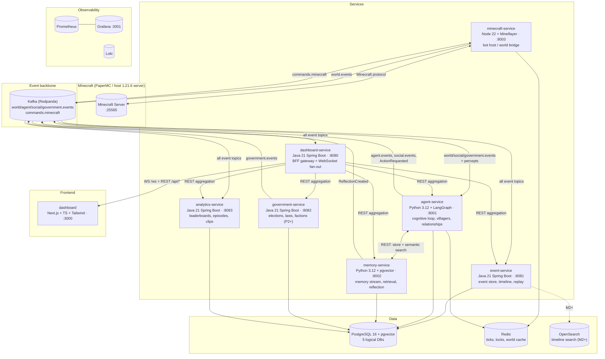

# AI Civilization Engine — System Overview

Twenty autonomous LLM-driven villagers live inside Minecraft. They have personalities, goals, memories, and relationships; they will go on to elect leaders, pass laws, form factions, and start rebellions. Every action in the system is an immutable event; the event stream is simultaneously the integration mechanism between services, the source of truth for analytics, and the raw material for YouTube episodes.

This document is the map. Deep dives live in the numbered docs alongside it:

| Doc | Contents |
|---|---|
| [01-domain-model.md](01-domain-model.md) | DDD bounded contexts, aggregates, invariants, ubiquitous language |
| [02-database.md](02-database.md) | ER diagram (all phases), runnable Phase-1 DDL, pgvector strategy |
| [03-events-kafka.md](03-events-kafka.md) | Topic map, event envelope + catalog, ordering/idempotency, replay |
| [04-api-design.md](04-api-design.md) | REST endpoints per service, conventions, WebSocket protocol, OpenAPI |
| [05-repository-devops.md](05-repository-devops.md) | Monorepo tree, Docker Compose profiles, CI/CD, config strategy |
| [06-roadmap-sprint-1.md](06-roadmap-sprint-1.md) | Milestones M0–M5, Sprint 1 ticket breakdown, risks |

## System Architecture

## Service Responsibilities

| Service | Stack | Owns (data) | Responsibility | Deliberately does NOT |
|---|---|---|---|---|
| **minecraft-service** | TypeScript / Node 22, Mineflayer | nothing (Redis session state only) | Embody villagers as bots; execute `ActionRequested` commands; observe the world and emit `world.events` | Think. It is a body, not a mind — no LLM calls, no persistence |
| **agent-service** | Python 3.12, FastAPI, LangGraph | `villagers`, `villager_goals`, `relationships` | The cognitive loop per villager: perceive → retrieve → deliberate (LLM) → act → reflect; LLM provider abstraction (OpenAI / Ollama / fake) | Touch Minecraft directly, or store memories itself |
| **memory-service** | Python 3.12, FastAPI, pgvector | `memories` | Generative-agents memory stream: importance/sentiment scoring, recency × importance × relevance retrieval, reflections. *Staged extraction: starts life as an in-process module of agent-service over its own `memory_db`; becomes a standalone service at M1 when reflections and embedding jobs justify the network hop* | Decide anything — it remembers, it doesn't think |
| **event-service** | Java 21, Spring Boot 3 | `events` (append-only store) | Persist every event permanently; timeline/replay APIs; OpenSearch indexing (M2+) | Interpret events — it is the system's ledger |
| **government-service** | Java 21, Spring Boot 3 | `elections`, `candidates`, `votes`, `laws`, `governments`, `factions`, `faction_members` | Elections, laws, factions as strict state machines (P2–P4) | Exist before M2 — schema designed now, zero code until then |
| **analytics-service** | Java 21, Spring Boot 3 | `villager_stats`, `approval_ratings`, `episodes`, `clips` | Kafka-driven projections: leaderboards, approval ratings, episode reports, clip markers for video editing | Serve as a source of truth — every table is rebuildable from the event store |
| **dashboard-service** | Java 21, Spring Boot 3 (MVC + WebSocket) | nothing | BFF gateway: `/api/*` REST aggregation for the browser; `/ws` WebSocket fan-out of live events with per-client drop-oldest backpressure. *Ships at M1/M2 when there is something to aggregate; Sprint 1's live feed is an SSE endpoint on event-service* | Contain domain logic |
| **dashboard** | Next.js, TS, Tailwind, React Query, Zustand, Recharts | — | Pages: Overview, Villagers, Government, Laws, Events, Factions, Relationships, Timeline, Analytics | Talk to any backend other than dashboard-service |

## Canonical Ports

Single source of truth — compose files and docs must match this table.

| Port | What |
|---|---|
| 3000 | Next.js dashboard |
| 3001 | Grafana (→3000 in-container) |
| 8001 / 8002 / 8003 | agent-service / memory-service / minecraft-service |
| 8080 | dashboard-service (BFF + WS) |
| 8081 / 8082 / 8083 | event-service / government-service / analytics-service |
| 8085 | Redpanda Console |
| 9092 | Kafka (Redpanda) |
| 5432 / 6379 / 9200 | Postgres / Redis / OpenSearch (M2+) |
| 9090 / 3100 | Prometheus / Loki |
| 25565 | Minecraft server (host or `minecraft` compose profile) |

## Why This Shape — Technology Rationale

Each choice is defensible in an interview; the concept it demonstrates is named.

- **Event-driven microservices over a monolith** — the domain is genuinely evented (everything villagers do is a fact that multiple consumers care about: memory, analytics, dashboard, future viewers). Kafka topics are the integration seam; services share JSON Schema contracts, never databases. *Concepts: pub/sub, loose coupling, database-per-service.*
- **CQRS command/event split** — `commands.minecraft` carries intent (may fail); `*.events` topics carry immutable facts. The event store is the write-side ledger; every analytics table is a disposable read model. *Concepts: CQRS, event sourcing (lite), rebuildable projections.*
- **Polyglot by necessity, not fashion** — Mineflayer is a JS library (Node), LangGraph/pgvector tooling is Python-native, and the transactional/streaming backbone plays to Spring Boot's strengths (Kafka consumers, JPA, Testcontainers). Three languages bound by one generated contract package. *Concepts: contract-first polyglot integration, codegen.*
- **Redpanda locally, "Kafka" everywhere in code** — single-binary broker, no ZooKeeper/KRaft ops, fraction of the RAM; wire-compatible so managed Kafka is a connection-string swap. *Concept: dev/prod parity with pragmatic local ops.*
- **Postgres for everything stateful (plus pgvector)** — five logical DBs on one local instance fake database-per-service honestly (Postgres forbids cross-DB queries in one connection). pgvector keeps semantic memory in the same operational envelope instead of adding a vector-DB service. *Concepts: bounded-context schema autonomy, HNSW ANN search.*
- **LLM provider abstraction with a fake** — OpenAI for quality, Ollama for free local iteration, a deterministic fake for tests so CI never spends a token. *Concepts: ports and adapters, hermetic testing.*
- **Observability as a feature** — decision latency, token cost, Kafka lag, and memory-retrieval latency are the product's vital signs and the video's B-roll. Correlation IDs chain percept → LLM decision → command → in-game action → memory across all services and logs. *Concepts: RED metrics, distributed tracing by correlation ID.*

## Design Review Process

This package went through a two-pass adversarial review before any code: six independently-authored deep-dive sections were cross-examined by a consistency critic (34 findings — port collisions, event-name drift, impossible flows) and a pragmatism critic (22 findings — solo-dev capacity, environment reality checked against the actual machine, LLM cost math, over-engineering). All findings were resolved with canonical rulings.

**Pragmatism rulings adopted:** Sprint 1 rescoped from ~100h to ~30h with the same filmable demo; CIV-0 environment bring-up added (Docker Desktop install, `~/.wslconfig`, Ollama model pulls — verified missing on the real machine); dashboard-service deferred to M1/M2 in favor of a ~30-line SSE endpoint on event-service, and built as plain Spring MVC + WebSocket rather than WebFlux when it lands; memory-service staged (in-process module over its own `memory_db` first, extracted at M1); OpenSearch held to M2 with Postgres FTS covering P1; Java codegen deferred to P2; tick cadence made first-class config (60s default, staggered) with a daily token-budget circuit breaker; the LLM-output→command seam given an explicit schema-validated contract; commands archived in the event store so causation chains stay whole; and the villager provisioning flow (spawn/despawn commands, seed endpoint, persona seed file) assigned to real tickets.

**Naming rulings that resolved real conflicts:**

- Law lifecycle events are `LawProposed → LawEnacted → LawBroken / LawRepealed / ViolationPunished` (not `LawCreated`).
- Raw in-game chat observed by the bridge is `ChatObserved` (world.events); the enriched conversational fact is `VillagerTalked` (social.events).
- `VillagerCreated` (identity provisioned) is distinct from `VillagerSpawned` (bot joined the world).
- `ReflectionCreated` is produced by memory-service onto `agent.events`; Cognition sees reflections via retrieval, never Kafka.
- Election state machine: `scheduled → nominating → voting → decided` (+ `annulled`).
- Projection rebuilds flow through the `replay.{replayId}` Kafka topic — no service ever reads another's database or calls its REST to do work (the two sanctioned REST paths: browser→BFF, agent→memory).
