# Domain Model (DDD)

Five bounded contexts, mapped 1:1-ish onto services: **World** (minecraft-service), **Cognition** (agent-service), **Memory** (memory-service), **Governance** (government-service), and **Chronicle/Analytics** (event-service + analytics-service). `dashboard-service` and `apps/dashboard` are delivery mechanisms (BFF + UI), not bounded contexts — they own no domain model. The JSON Schemas in `packages/events` are the **Published Language**; Kafka is the **Open-Host Service** through which contexts integrate. Interview concept: context mapping — every arrow below is a named strategic-DDD relationship, not just a data flow.

## 1. Context Map

```mermaid
flowchart TB
    PL["Published Language:<br/>packages/events JSON Schemas<br/>(single source of truth, codegen to TS/Java/Py)"]

    WORLD["World Context<br/>minecraft-service (TS)"]
    COG["Cognition Context<br/>agent-service (Python)"]
    MEM["Memory Context<br/>memory-service (Python)"]
    GOV["Governance Context<br/>government-service (Java)"]
    CHRON["Chronicle / Analytics Context<br/>event-service + analytics-service (Java)"]

    WORLD -->|"world.events — Upstream; Cognition translates via Perception ACL"| COG
    COG -->|"commands.minecraft: ActionRequested — CQRS command topic; World is Conformist to the command schema"| WORLD
    COG -->|"REST store/retrieve — Customer (Cognition) / Supplier (Memory)"| MEM
    MEM -->|"ReflectionCreated on agent.events"| CHRON
    COG -->|"agent.events + social.events"| GOV
    GOV -->|"government.events — Cognition consumes via ACL (laws/elections become Percepts)"| COG

    WORLD -->|"world.events"| CHRON
    COG -->|"agent.events, social.events"| CHRON
    GOV -->|"government.events"| CHRON

    PL -.->|"contract tests bind every producer/consumer"| WORLD
    PL -.-> COG
    PL -.-> GOV
    PL -.-> CHRON

    style CHRON stroke-dasharray: 5 5
```

Reading the map:

- **World → Cognition** — World is upstream; raw Minecraft facts (coordinates, block IDs, entity IDs) are translated by an **Anti-Corruption Layer** in agent-service into domain `Percept`s, so Mineflayer vocabulary never leaks into the cognitive model.
- **Cognition → World** — commands, not events (`ActionRequested` on `commands.minecraft`). This is the **CQRS split**: intent flows one way, facts flow back the other (`ActionCompleted`/`ActionFailed` on `world.events`).
- **Cognition ↔ Memory** — synchronous **Customer/Supplier**: Cognition drives Memory's API roadmap (retrieval scoring exists to serve deliberation). Memory publishes `ReflectionCreated` to `agent.events` for the historical record (Chronicle consumes it); Cognition never consumes it from Kafka — reflections surface naturally through the next retrieval call.
- **Governance ↔ Cognition** — mutual event consumption through the Published Language; Cognition wraps `government.events` in the same Perception ACL (a new law is just another thing a villager perceives).
- **Chronicle/Analytics** — a pure **Conformist**: it consumes every topic exactly as published, never asks upstreams to change, and emits no domain events. It is the terminal read side (event store + projections).

## 2. Contexts: Aggregates, Entities, Value Objects, Events, Invariants

### World Context (minecraft-service) — "what physically happened"

| | |
|---|---|
| **Aggregate** | `BotSession` (root; in-memory/Redis only — this context owns no tables, deliberately) |
| **Entities** | none persisted |
| **Value objects** | `Position`, `InventorySnapshot`, `PathPlan`, `ActionOutcome`, `BlockTarget` |
| **Emits** (`world.events`) | `VillagerSpawned`, `VillagerMoved`, `ResourceGathered`, `VillagerDamaged`, `VillagerDied`, `ChatObserved`, `ActionCompleted`, `ActionFailed` |
| **Invariants** | Exactly one `BotSession` per villagerId per server. Commands for one villager execute strictly in order (partition key = villagerId). Every `ActionRequested` terminates in exactly one `ActionCompleted` or `ActionFailed` carrying the command's id as `causationId` — no silent drops (interview concept: request/response over async messaging via correlation). |

### Cognition Context (agent-service) — "who the villager is and what they decide"

| | |
|---|---|
| **Aggregate** | `Villager` (root) — the only place the full person exists |
| **Entities** | `Goal`, `Relationship` |
| **Value objects** | `Personality` (immutable trait vector), `Percept`, `Decision`, `Utterance` |
| **Emits** | `agent.events`: `VillagerCreated`, `DecisionMade`, `GoalChanged`, `MemoryFormed` · `social.events`: `VillagerTalked`, `RelationshipChanged`, `BetrayalRecorded` · commands: `ActionRequested` → `commands.minecraft` |
| **Invariants** | At most one in-flight `Decision` per villager — enforced by an in-process per-villager guard today (agent-service is one process); the tick is designed to be lock-guardable via Redis the day agent-service shards to multiple instances, and not before (interview concept: knowing when distributed mutual exclusion is premature). `Personality` is immutable after creation. Relationship score bounded [-100, 100] and changes only via recorded interactions. ≤ 3 active `Goal`s, exactly one marked current. Every `DecisionMade` carries `causationId` linking back to the triggering percept/tick — full decision provenance. |

### Memory Context (memory-service) — "what the villager remembers"

| | |
|---|---|
| **Aggregate** | `MemoryStream` (root; one per villager) |
| **Entities** | `Memory`, `Reflection` |
| **Value objects** | `Embedding`, `ImportanceScore` (0–10), `SentimentScore` (−1..1), `RetrievalScore` |
| **Emits** | `ReflectionCreated` (on `agent.events`, aggregateId = villagerId) |
| **Invariants** | Memory content and scores are immutable after write — never edited or deleted; only access metadata (`last_accessed_at`, `access_count`) mutates, feeding the recency term. Every memory belongs to exactly one villager's stream. Retrieval ranking is always `recency × importance × relevance` — the formula is domain logic, not an implementation detail. A `Reflection` must cite ≥ 1 source memory. Embedding dimensionality is fixed per configured model. |

### Governance Context (government-service) — "the rules villagers made for themselves" (implemented: election state machine + idempotent ballot box, REST-driven since M2-6, Kafka contracts from M2-7)

| | |
|---|---|
| **Aggregates** | `Election` (root; entities `Candidate`, `Vote`), `Government` (root), `Law` (root), `Faction` (root; entity `FactionMember`) |
| **Value objects** | `BallotChoice`, `Term`, `Penalty`, `Platform` |
| **Emits** (`government.events`) | `ElectionStarted`, `CandidateNominated`, `VoteCast`, `ElectionDecided`, `LawProposed`, `LawEnacted`, `LawBroken`, `LawRepealed`, `ViolationPunished`, `FactionCreated`, `FactionJoined`, `RebellionStarted` |
| **Invariants** | One vote per (electionId, voterId) — duplicate `VoteCast` is rejected, making vote submission **idempotent** (the interview example for at-least-once delivery). Election follows a strict state machine: `scheduled → nominating → voting → decided` (with `annulled` as the exceptional terminal state). A `Law` can only be enacted by a seated `Government`. A villager belongs to ≤ 1 faction per civilization. Known open limitation: vote casting currently serializes on a pessimistic per-election row lock (`SELECT … FOR UPDATE`); its removal is ranked open work in `docs/reports/bottleneck-report-2026-07-17.md`. |

### Chronicle/Analytics Context (event-service + analytics-service) — "what history says happened"

| | |
|---|---|
| **Aggregates** | Chronicle side: none — `StoredEvent` is deliberately anemic and immutable (an event store, not a behavioral model). Analytics side: `Episode` (root; entity `Clip`) |
| **Value objects** | `EventEnvelope`, `TimelineEntry`, `LeaderboardRow`, `ApprovalRating`, `ClipMarker` |
| **Emits** | Nothing. Terminal consumer; read models exposed via REST (CQRS read side — projections, not sources of truth) |
| **Invariants** | Event store is append-only; ingestion deduplicates on `eventId` (UUIDv7) so replays and consumer restarts are **idempotent**. Every projection is derivable purely from the event store and rebuildable via replay — dropping a read model is always safe. A `Clip` must reference a contiguous eventId range that exists in the store. |

## 3. Ubiquitous Language Glossary

| Term | Meaning |
|---|---|
| **Villager** | An autonomous LLM-driven inhabitant; the central aggregate of Cognition, identified everywhere by `villagerId` (UUID). |
| **Personality** | Immutable trait vector (e.g., bravery, greed, sociability) fixed at villager creation; biases every deliberation prompt. |
| **Goal** | A villager's current objective (gather wood, befriend Elara); has priority and lifecycle, changed only by deliberation. |
| **Percept** | A domain-translated observation entering the cognitive loop (from world, social, or governance events) via the ACL. |
| **Tick** | One scheduled turn of a villager's cognitive loop (perceive → retrieve → deliberate → act → reflect), paced by Redis. |
| **Decision** | The recorded output of one deliberation: chosen action + cited memories + reasoning; provenance for every behavior. |
| **Action / ActionRequested** | The command a villager issues to the world; requested on `commands.minecraft`, confirmed by `ActionCompleted`/`ActionFailed`. |
| **BotSession** | The live Mineflayer connection embodying one villager in Minecraft; ephemeral, no personality. |
| **Memory** | One append-only observation in a villager's stream, scored for importance and sentiment, embedded for retrieval. |
| **Importance** | 0–10 LLM-assigned score of how much a memory matters; multiplies into retrieval ranking. |
| **Reflection** | A periodic higher-level summary synthesized from clustered memories ("I don't trust Bram anymore"). |
| **Relationship** | A directed, scored (−100..100) link between two villagers, mutated only by recorded interactions. |
| **Betrayal** | A relationship-damaging act significant enough to be recorded as its own social event. |
| **Election** | A time-boxed governance process producing an officeholder from candidates and votes. |
| **Vote** | One villager's single, idempotent ballot in one election. |
| **Law** | A rule enacted by a seated government that villagers may obey or break; violations emit `LawBroken`. |
| **Government** | The currently seated authority (mayor + term) empowered to enact laws. |
| **Faction** | A named allegiance group of villagers; the unit of parties and rebellions. |
| **Event Envelope** | The mandatory wrapper on every event: eventId, eventType, schemaVersion, occurredAt, source, aggregate refs, correlation/causation ids, payload. |
| **Correlation Id** | The thread linking one causal chain (percept → decision → command → world outcome → memory) across all services and logs. |
| **Timeline** | The Chronicle's queryable, ordered history of everything that happened; Postgres-backed — keyset-paginated reads with a GIN index for search plus an `(aggregate_type, occurred_at)` filter index (PR #37; see `docs/reports/bottleneck-report-2026-07-17.md`). Range-partitioning the ledger by `occurred_at` is the open scaling item. |
| **Projection** | A Kafka-derived read model (leaderboard, approval rating) that is disposable and rebuildable by replay. |
| **Episode** | An analytics-produced narrative report over a time window, used to script a YouTube video. |
| **Clip** | A marked eventId range flagged as video-worthy (a betrayal, an election upset) for the editor. |

## 4. One Noun, Five Models: "Villager" in Each Context

The classic DDD talking point: there is no shared `Villager` class in `packages/` — only the `villagerId` UUID crosses context boundaries, and each context models exactly the facets it needs.

| Context | The villager is a… | What the model contains | What it deliberately doesn't know |
|---|---|---|---|
| **World** | **Bot** — a `BotSession` | Connection state, position, health, inventory, current path | Personality, goals, memories — the bot is a body, not a mind |
| **Cognition** | **Person** — the `Villager` aggregate root | Identity, `Personality`, `Goal`s, `Relationship`s; the only context permitted to change *who someone is* | Block coordinates, ballot tallies, embedding vectors |
| **Memory** | **Subject** — a stream owner | Just a foreign key partitioning the `MemoryStream`; there is no villager row at all | Everything except what was experienced — Memory stores *about*, never *is* |
| **Governance** | **Citizen** — voter / candidate / officeholder / faction member | Politically relevant facts only: eligibility, votes cast, offices held, faction allegiance | Personality and memories — the ballot box doesn't care why you voted |
| **Chronicle/Analytics** | **Character** — an `aggregateId` and a protagonist | An approval curve, a leaderboard row, a role in an episode's narrative | Any live state — it models what history recorded, never what is currently true |

This split is what lets each phase land without cross-service schema churn: adding elections in P2 touches the Citizen model only; the Bot, the Person, and the Subject don't change.
