# Database Design

One PostgreSQL 16 instance (Docker, `pgvector/pgvector:pg16` image) hosts **five logical databases — one per data-owning service**. Postgres refuses cross-database queries within a single connection, so the isolation is honest even on a laptop: a service physically cannot join into another service's tables. `minecraft-service` and `dashboard-service` own no tables by design (bot session state lives in Redis; the BFF is stateless).

| Logical DB | Owning service | Tables | Phase |
|---|---|---|---|
| `agent_db` | agent-service | `villagers`, `villager_goals`, `relationships` | P1 |
| `memory_db` | memory-service | `memories` | P1 |
| `event_db` | event-service | `events` (append-only event store) | P1 |
| `government_db` | government-service | `elections`, `candidates`, `votes`, `laws`, `governments`, `factions`, `faction_members` | P2–P4 (schema designed now, built later) |
| `analytics_db` | analytics-service | `villager_stats`, `approval_ratings`, `episodes`, `clips` (all projections, rebuildable) | P1+ |

All IDs are UUIDs (UUIDv7 for anything time-ordered), all timestamps `timestamptz` UTC, tables snake_case plural.

## ER Diagram (all services, all phases)

**Legend:** solid lines = real foreign keys (same logical DB). Dotted lines = *logical* references across service boundaries — **no cross-database FK constraints exist**; referential integrity across services is maintained by the event flow, not the database. This is the database-per-service rule made visible.

```mermaid
erDiagram
    %% ============================================================
    %% agent-service :: agent_db :: PHASE 1
    %% ============================================================
    villagers {
        uuid id PK "UUIDv7"
        text name UK
        text minecraft_username UK "bot login (online-mode=false)"
        jsonb personality "traits, values, speech style, quirks"
        text backstory
        text status "alive | dead | despawned"
        jsonb home_position "x, y, z, dimension"
        timestamptz created_at
        timestamptz updated_at
    }
    villager_goals {
        uuid id PK
        uuid villager_id FK
        uuid parent_goal_id FK "self-ref: goal decomposition"
        text description
        text goal_type "survival | social | resource | exploration | personal"
        smallint priority "1..10"
        boolean is_current "exactly one per villager (partial unique index)"
        text status "active | completed | abandoned | blocked"
        timestamptz created_at
        timestamptz completed_at
    }
    relationships {
        uuid id PK
        uuid villager_id FK "directed edge source: the opinion holder"
        uuid target_villager_id FK "directed edge target"
        smallint affinity "-100..100"
        smallint trust "0..100"
        int interaction_count
        timestamptz last_interaction_at
        timestamptz created_at
        timestamptz updated_at
    }

    %% ============================================================
    %% memory-service :: memory_db :: PHASE 1
    %% ============================================================
    memories {
        uuid id PK "UUIDv7"
        uuid villager_id "logical ref to agent_db - no cross-DB FK"
        text memory_type "observation | conversation | action | reflection"
        text content
        real importance_score "0..10, LLM-scored at write time"
        real sentiment_score "-1..1"
        vector embedding "vector(768), HNSW cosine index"
        text embedding_model "provenance tag per row"
        uuid source_event_id "logical ref into event store"
        uuid_array source_memory_ids "reflection provenance"
        timestamptz occurred_at
        timestamptz last_accessed_at "recency term of retrieval score"
        int access_count
        timestamptz created_at
    }

    %% ============================================================
    %% event-service :: event_db :: PHASE 1
    %% ============================================================
    events {
        uuid event_id PK "UUIDv7 - time-ordered, dedupe key"
        text event_type "PascalCase, e.g. VillagerTalked"
        int schema_version
        timestamptz occurred_at
        timestamptz recorded_at "server-side ingest time"
        text source "producing service"
        text aggregate_type "PascalCase: Villager | Election | Faction | ..."
        uuid aggregate_id "Kafka partition key"
        uuid correlation_id
        uuid causation_id
        text topic
        jsonb payload "validated against packages/events JSON Schema"
    }

    %% ============================================================
    %% government-service :: government_db :: PHASE 2-4 (columns only, no DDL yet)
    %% ============================================================
    governments {
        uuid id PK
        text name
        text government_type "P2 mayoralty; later council, theocracy"
        uuid mayor_villager_id "logical ref"
        jsonb charter
        timestamptz established_at
        timestamptz dissolved_at
    }
    elections {
        uuid id PK
        uuid government_id FK
        text office "P2: mayor"
        text status "scheduled | nominating | voting | decided | annulled"
        uuid winner_candidate_id FK
        timestamptz starts_at
        timestamptz ends_at
    }
    candidates {
        uuid id PK
        uuid election_id FK
        uuid villager_id "logical ref; UNIQUE(election_id, villager_id)"
        jsonb platform "LLM-generated campaign promises"
        timestamptz registered_at
    }
    votes {
        uuid id PK
        uuid election_id FK
        uuid candidate_id FK
        uuid voter_villager_id "logical ref; UNIQUE(election_id, voter_villager_id)"
        text reason "LLM rationale - episode gold"
        timestamptz cast_at
    }
    laws {
        uuid id PK
        uuid government_id FK
        uuid proposed_by_villager_id "logical ref"
        text title
        text description
        text status "proposed | enacted | repealed | vetoed"
        jsonb penalty "P3 punishment spec"
        timestamptz enacted_at
        timestamptz repealed_at
    }
    factions {
        uuid id PK
        text name UK
        text ideology
        uuid founded_by_villager_id "logical ref"
        text status "active | disbanded | rebelling"
        timestamptz founded_at
        timestamptz disbanded_at
    }
    faction_members {
        uuid id PK
        uuid faction_id FK
        uuid villager_id "logical ref; UNIQUE(faction_id, villager_id)"
        text role "leader | officer | member"
        timestamptz joined_at
        timestamptz left_at
    }

    %% ============================================================
    %% analytics-service :: analytics_db :: projections (P1+), rebuildable from events
    %% ============================================================
    villager_stats {
        uuid villager_id PK "1:1 projection, rebuildable by replay"
        real popularity_score
        real notoriety_score
        real lawfulness_score
        real chaos_score
        real influence_score
        int conversations_count
        int laws_broken_count "P3+"
        uuid last_event_id "UUIDv7 high-water mark: idempotent projection upserts"
        timestamptz updated_at
    }
    approval_ratings {
        uuid id PK
        text subject_type "mayor | government | faction"
        uuid subject_id "logical ref; natural key (subject_type, subject_id, window_start)"
        real rating "0..100"
        int sample_size
        uuid last_event_id "UUIDv7 high-water mark: idempotent projection upserts"
        timestamptz window_start
        timestamptz window_end
    }
    episodes {
        uuid id PK
        int episode_number UK
        text title
        text status "draft | rendered | published"
        timestamptz window_start
        timestamptz window_end
        text summary_md "LLM-written episode report"
        timestamptz published_at
    }
    clips {
        uuid id PK
        uuid episode_id FK
        text clip_type "betrayal | election | fight | funny | milestone"
        text title
        real drama_score "ranking for the edit"
        uuid_array source_event_ids "replay pointers into event store"
        timestamptz starts_at
        timestamptz ends_at
    }

    %% ---- intra-DB (solid, real FKs) ----
    villagers ||--o{ villager_goals : "has"
    villager_goals |o--o{ villager_goals : "parent_goal_id"
    villagers ||--o{ relationships : "holds opinion (source)"
    villagers ||--o{ relationships : "is judged (target)"
    governments ||--o{ elections : "runs"
    elections ||--o{ candidates : "fields"
    elections ||--o{ votes : "collects"
    candidates ||--o{ votes : "receives"
    governments ||--o{ laws : "enacts"
    factions ||--o{ faction_members : "has"
    episodes ||--o{ clips : "contains"

    %% ---- cross-service (dotted, logical refs, NO FK) ----
    villagers ||..o{ memories : "villager_id"
    events |o..o{ memories : "source_event_id"
    villagers ||..o{ events : "aggregate_id (usually)"
    villagers ||..o{ candidates : "villager_id"
    villagers ||..o{ votes : "voter_villager_id"
    villagers ||..o{ faction_members : "villager_id"
    villagers ||..|| villager_stats : "projected from events"
    governments |o..o{ approval_ratings : "subject_id"
```



## Logical database bootstrap (Docker Compose init script)

```sql
-- infrastructure/docker/postgres-init/01-databases.sql
-- Mounted into /docker-entrypoint-initdb.d/ of the single local Postgres container.
-- One role + one logical DB per data-owning service: database-per-service, faked
-- on one instance. In production these become separate instances with zero schema changes.
CREATE ROLE agent_service      LOGIN PASSWORD 'agent_service_dev';
CREATE ROLE memory_service     LOGIN PASSWORD 'memory_service_dev';
CREATE ROLE event_service      LOGIN PASSWORD 'event_service_dev';
CREATE ROLE government_service LOGIN PASSWORD 'government_service_dev';
CREATE ROLE analytics_service  LOGIN PASSWORD 'analytics_service_dev';

CREATE DATABASE agent_db      OWNER agent_service;
CREATE DATABASE memory_db     OWNER memory_service;
CREATE DATABASE event_db      OWNER event_service;
CREATE DATABASE government_db OWNER government_service;
CREATE DATABASE analytics_db  OWNER analytics_service;

-- Extension creation is a superuser operation — it happens HERE, in the init
-- script, never in a service migration (the service roles are not superuser).
-- Alembic/Flyway migrations assert the extension exists and fail fast if not.
\connect memory_db
CREATE EXTENSION IF NOT EXISTS vector;
```

## Phase 1 DDL

Phase 1 ships exactly five tables. PKs have **no database default**: services generate UUIDv7 in the application layer (`uuid7` in Python, `uuidv7` in TS, `java-uuid-generator` in Java) because Postgres 16 has no native `uuidv7()` (it lands in PG18). UUIDv7 PKs are time-ordered, so B-tree inserts are append-mostly — no random-page-split penalty of UUIDv4 (interview concept: **index locality / write amplification**).

### `agent_db` — villagers, villager_goals, relationships

```sql
-- ======================================================================
-- agent_db :: owned by agent-service :: Phase 1
-- ======================================================================

CREATE OR REPLACE FUNCTION set_updated_at() RETURNS trigger
LANGUAGE plpgsql AS $$
BEGIN
    NEW.updated_at := now();
    RETURN NEW;
END $$;

CREATE TABLE villagers (
    id                 uuid        PRIMARY KEY,                 -- UUIDv7, app-generated
    name               text        NOT NULL UNIQUE,
    minecraft_username text        NOT NULL UNIQUE,             -- bot login name (online-mode=false)
    personality        jsonb       NOT NULL DEFAULT '{}'::jsonb
                       CHECK (jsonb_typeof(personality) = 'object'),
    backstory          text,
    status             text        NOT NULL DEFAULT 'alive'
                       CHECK (status IN ('alive', 'dead', 'despawned')),
    home_position      jsonb,                                   -- {"x":..,"y":..,"z":..,"dimension":"overworld"}
    created_at         timestamptz NOT NULL DEFAULT now(),
    updated_at         timestamptz NOT NULL DEFAULT now()
);

CREATE TRIGGER trg_villagers_updated_at
    BEFORE UPDATE ON villagers
    FOR EACH ROW EXECUTE FUNCTION set_updated_at();

CREATE TABLE villager_goals (
    id             uuid        PRIMARY KEY,
    villager_id    uuid        NOT NULL REFERENCES villagers (id) ON DELETE CASCADE,
    parent_goal_id uuid        REFERENCES villager_goals (id) ON DELETE CASCADE,  -- goal decomposition tree
    description    text        NOT NULL,
    goal_type      text        NOT NULL
                   CHECK (goal_type IN ('survival', 'social', 'resource', 'exploration', 'personal')),
    priority       smallint    NOT NULL DEFAULT 5 CHECK (priority BETWEEN 1 AND 10),
    is_current     boolean     NOT NULL DEFAULT false,
    status         text        NOT NULL DEFAULT 'active'
                   CHECK (status IN ('active', 'completed', 'abandoned', 'blocked')),
    created_at     timestamptz NOT NULL DEFAULT now(),
    completed_at   timestamptz,
    CONSTRAINT goals_completed_at_consistent
        CHECK (completed_at IS NULL OR status = 'completed'),
    CONSTRAINT goals_current_must_be_active
        CHECK (NOT is_current OR status = 'active')
);

-- The cognitive loop's hottest query: "active goals for this villager, by priority".
CREATE INDEX idx_villager_goals_villager_status
    ON villager_goals (villager_id, status, priority DESC);

-- Domain invariant "exactly one current goal per villager", enforced in the schema.
CREATE UNIQUE INDEX idx_villager_goals_one_current
    ON villager_goals (villager_id) WHERE is_current;

CREATE TABLE relationships (
    id                  uuid        PRIMARY KEY,
    villager_id         uuid        NOT NULL REFERENCES villagers (id) ON DELETE CASCADE,
    target_villager_id  uuid        NOT NULL REFERENCES villagers (id) ON DELETE CASCADE,
    affinity            smallint    NOT NULL DEFAULT 0  CHECK (affinity BETWEEN -100 AND 100),
    trust               smallint    NOT NULL DEFAULT 50 CHECK (trust    BETWEEN 0    AND 100),
    interaction_count   integer     NOT NULL DEFAULT 0  CHECK (interaction_count >= 0),
    last_interaction_at timestamptz,
    created_at          timestamptz NOT NULL DEFAULT now(),
    updated_at          timestamptz NOT NULL DEFAULT now(),
    CONSTRAINT relationships_no_self_edge  CHECK (villager_id <> target_villager_id),
    CONSTRAINT relationships_directed_uniq UNIQUE (villager_id, target_villager_id)
);

CREATE TRIGGER trg_relationships_updated_at
    BEFORE UPDATE ON relationships
    FOR EACH ROW EXECUTE FUNCTION set_updated_at();

-- Reverse lookups: "who has opinions about Bob?" (feeds popularity projections).
CREATE INDEX idx_relationships_target ON relationships (target_villager_id, affinity DESC);
```

**Why directed edges:** Alice can adore Bob (affinity +80, trust 90) while Bob quietly distrusts Alice (affinity +10, trust 20) — asymmetric opinion is precisely what generates betrayals, unrequited alliances, and one side turning first, i.e. the drama the show is built on. An undirected edge would force both villagers to share a single opinion, erasing those storylines; each ordered pair gets its own row, enforced clean by `UNIQUE (villager_id, target_villager_id)` plus the no-self-edge `CHECK`.

### `memory_db` — memories (pgvector)

**Embedding strategy — fixed `vector(768)`.** Chosen deliberately over 1536-with-padding: Ollama's `nomic-embed-text` emits 768 dimensions natively, and OpenAI's `text-embedding-3-small` was trained with Matryoshka Representation Learning, so requesting `dimensions: 768` in the API yields properly re-normalized vectors with ~1–2% quality loss — no padding hack, and half the HNSW index memory of 1536. Zero-padding was rejected because it wastes index RAM and, worse, implies vectors from different models share a space — they never do. The rule is **one embedding model per deployment**, recorded per-row in `embedding_model`; switching providers means an offline re-embed backfill job, and the provenance column makes stale rows detectable and the migration verifiable.

```sql
-- ======================================================================
-- memory_db :: owned by memory-service :: Phase 1
-- (vector extension created by the superuser init script, not here)
-- ======================================================================
CREATE TABLE memories (
    id                uuid        PRIMARY KEY,      -- UUIDv7
    villager_id       uuid        NOT NULL,         -- logical ref to agent_db.villagers: NO cross-DB FK
    memory_type       text        NOT NULL
                      CHECK (memory_type IN ('observation', 'conversation', 'action', 'reflection')),
    content           text        NOT NULL,
    importance_score  real        NOT NULL CHECK (importance_score BETWEEN 0 AND 10),  -- LLM-scored at write
    sentiment_score   real        NOT NULL DEFAULT 0 CHECK (sentiment_score BETWEEN -1 AND 1),
    embedding         vector(768) NOT NULL,
    embedding_model   text        NOT NULL,         -- 'text-embedding-3-small@768' | 'nomic-embed-text'
    source_event_id   uuid,                         -- causation link into the event store (logical ref)
    source_memory_ids uuid[],                       -- reflections: which memories were distilled
    occurred_at       timestamptz NOT NULL,
    created_at        timestamptz NOT NULL DEFAULT now(),
    last_accessed_at  timestamptz NOT NULL DEFAULT now(),  -- recency term of the retrieval score
    access_count      integer     NOT NULL DEFAULT 0,
    CONSTRAINT memories_reflection_provenance
        -- NULL-proof: CHECKs pass on NULL (three-valued logic), so the
        -- reflection branch must assert IS NOT NULL explicitly.
        CHECK (
            (memory_type <> 'reflection' AND source_memory_ids IS NULL)
            OR
            (memory_type = 'reflection' AND source_memory_ids IS NOT NULL
             AND array_length(source_memory_ids, 1) >= 1)
        )
);

-- Recency scans: "most recent memories for this villager".
CREATE INDEX idx_memories_villager_time ON memories (villager_id, occurred_at DESC);

-- Reflection scan: "importance accrued since last reflection" (PR #37 — the
-- scheduler's 300s sweep filters on (villager_id, memory_type, created_at),
-- which the recency index above does not serve).
CREATE INDEX idx_memories_villager_type_created ON memories (villager_id, memory_type, created_at);

-- ANN index for the relevance term of retrieval (recency x importance x relevance).
-- Cosine ops: safe for both providers regardless of normalization guarantees.
CREATE INDEX idx_memories_embedding_hnsw
    ON memories USING hnsw (embedding vector_cosine_ops)
    WITH (m = 16, ef_construction = 64);
```

Retrieval queries filter `WHERE villager_id = $1` then rank by cosine similarity; pgvector's HNSW walks one global graph and post-filters the villager predicate, so recall and latency degrade with **total** row count over time, not villager count — a long-running 20-villager world hits it just as surely as a 100-villager one. Since PR #37 every retrieval sizes the walk per query: a transaction-local `hnsw.ef_search = max(40, candidates × 4)` set on the same transaction as the ANN query (via `set_config(..., true)`; defaults land at 120 — see `docs/reports/bottleneck-report-2026-07-17.md`). Remaining open work: a periodic decay/archival job for low-importance, long-untouched memories; `hnsw.iterative_scan` (pgvector 0.8+) stays the next escalation rather than a redesign.

### `event_db` — events (append-only event store)

```sql
-- ======================================================================
-- event_db :: owned by event-service :: Phase 1
-- ======================================================================
CREATE TABLE events (
    event_id       uuid        PRIMARY KEY,         -- UUIDv7: time-ordered AND the idempotency key
    event_type     text        NOT NULL,            -- PascalCase: 'VillagerTalked', 'DecisionMade', ...
    schema_version integer     NOT NULL DEFAULT 1 CHECK (schema_version >= 1),
    occurred_at    timestamptz NOT NULL,            -- producer clock (from the envelope)
    recorded_at    timestamptz NOT NULL DEFAULT now(),  -- ingest clock (skew diagnostics)
    source         text        NOT NULL,            -- producing service name
    aggregate_type text        NOT NULL,            -- PascalCase: 'Villager', 'Election', 'Faction', ...
    aggregate_id   uuid        NOT NULL,            -- mirrors the Kafka partition key
    correlation_id uuid        NOT NULL,
    causation_id   uuid,
    topic          text        NOT NULL,            -- 'world.events', 'social.events', ...
    payload        jsonb       NOT NULL CHECK (jsonb_typeof(payload) = 'object')
);

-- Aggregate timeline / replay: "everything that happened to villager X, in order".
CREATE INDEX idx_events_aggregate ON events (aggregate_id, occurred_at);
-- Type-sliced timelines: "all BetrayalRecorded events last week".
CREATE INDEX idx_events_type      ON events (event_type, occurred_at);
-- Aggregate-type filter (REST /events?aggregateType=...) — a full ledger scan until PR #37.
CREATE INDEX idx_events_aggregate_type ON events (aggregate_type, occurred_at);
-- Trace a causal chain across services (structured logs carry the same id).
CREATE INDEX idx_events_correlation ON events (correlation_id);

-- Timeline full-text search, Postgres-native. Serves single-digit millions of
-- rows comfortably; OpenSearch takes over at M2 when the dashboard timeline
-- page ships full-text search as a feature. "We measured, then migrated."
ALTER TABLE events ADD COLUMN search_text tsvector
    GENERATED ALWAYS AS (
        to_tsvector('english', event_type || ' ' || coalesce(payload->>'message', '') || ' ' || coalesce(payload->>'reason', ''))
    ) STORED;
CREATE INDEX idx_events_search ON events USING gin (search_text);

-- Append-only enforced in the database, not by convention: belt (privileges)...
REVOKE UPDATE, DELETE, TRUNCATE ON events FROM event_service;
-- ...and suspenders (trigger), so even the owner role cannot rewrite history.
CREATE OR REPLACE FUNCTION events_append_only() RETURNS trigger
LANGUAGE plpgsql AS $$
BEGIN
    RAISE EXCEPTION 'events is an append-only event store: % not allowed', TG_OP;
END $$;

CREATE TRIGGER trg_events_append_only
    BEFORE UPDATE OR DELETE ON events
    FOR EACH ROW EXECUTE FUNCTION events_append_only();
```

The consumer — a batch listener at concurrency 3 since PR #37 — writes each poll batch as one multi-row `INSERT ... ON CONFLICT (event_id) DO NOTHING`, and offsets commit only after the whole batch is stored — the UUIDv7 PK doubles as the dedupe key, making persistence safe under Kafka's at-least-once redelivery, per record and per batch (interview concept: **idempotent consumer**).

**Partitioning scale path (deferred, deliberately):** at 20 villagers the event store grows slowly, but at 100+ villagers across multiple servers it becomes the largest table in the system by far. The migration is native Postgres declarative range partitioning: recreate `events` as `PARTITION BY RANGE (occurred_at)` with monthly partitions (`events_2026_07`, ...), pre-created by pg_partman or a scheduled job. The PK becomes composite `(event_id, occurred_at)` — Postgres requires the partition key in every unique constraint — which is harmless since `event_id` alone still dedupes within any realistic redelivery window. Timeline queries get partition pruning for free, and old months can be detached and archived to cheap storage without touching hot data. It is a mechanical migration (replay-refill from Kafka or `INSERT SELECT`), which is exactly why it is not built in Phase 1.

## Design Notes

**Database-per-service.** Each service owns its schema and migrates it independently (Alembic for Python services, Flyway for Java); no service ever joins another's tables — cross-context reads happen via events or REST. Locally this is faked with one Postgres container, five logical databases, and five roles (bootstrap script above); because Postgres cannot query across databases on one connection, the boundary is enforced, not aspirational. Splitting to real instances later is a connection-string change. (Interview concepts: **DDD bounded contexts, schema autonomy, no shared-database antipattern**.)

**Cross-service references are logical, not FKs.** `memories.villager_id`, `votes.voter_villager_id`, etc. carry UUIDs into another service's context with no constraint. Consistency is eventual and event-driven — if a villager dies, a `world.events` event propagates and each service reacts in its own context. (Interview concept: **eventual consistency at context boundaries**.)

**Why `jsonb` for payloads and personality.** Event payloads vary per `event_type` and evolve per phase; `jsonb` keeps the store generic while the real contract lives in `packages/events` JSON Schemas, validated at the producer/consumer boundary — schema-on-write at the application layer, flexible at the storage layer. Same logic for `personality`: LLM prompt inputs (traits, quirks, speech style) will be iterated on constantly during the series and must not require a migration per tweak. `jsonb` stays queryable (`payload->>'targetVillagerId'`) and GIN-indexable the day a query needs it.

**What the event store enables — event sourcing *lite*.** Every `events` row is an immutable fact, so: (1) analytics-service can rebuild any projection (`villager_stats`, `approval_ratings`, leaderboards) from scratch by replaying — projections are disposable caches, never sources of truth (interview concept: **CQRS with rebuildable read models**); (2) the OpenSearch index can be re-created after a mapping change by re-indexing from Postgres; (3) `correlation_id`/`causation_id` chains answer "*why* did Villager 7 betray the mayor" step by step — which is also the episode-writing pipeline: `clips.source_event_ids` point straight back into the store for replayable, citable drama. It is deliberately *lite*: services keep current-state tables (`villagers`, `relationships`) as their write models rather than rehydrating aggregates from events on every request — full event sourcing is complexity Phase 1 does not need.