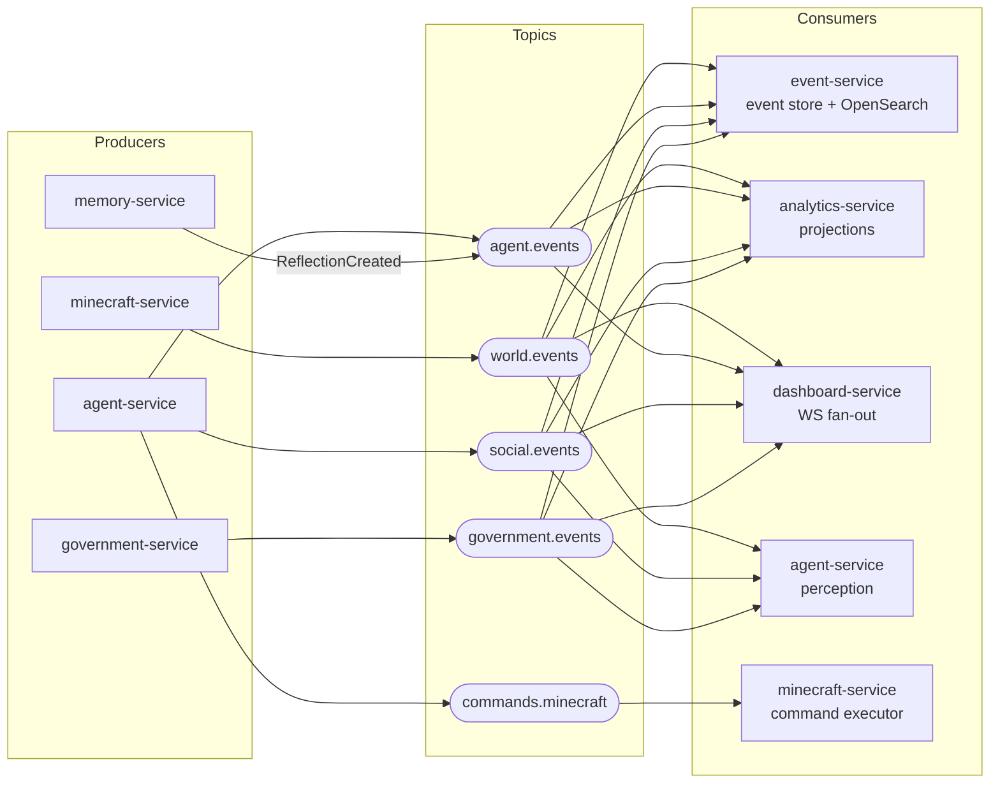

# Event & Kafka Design

The broker is Redpanda locally, spoken to via the Kafka protocol — it is called "Kafka" in all code, config, and docs. Kafka is the **transport**; the Postgres event store owned by event-service is the **system of record**. That separation drives every decision below (short topic retention, replay from Postgres, dedup on `eventId`).



## 1. Topic Map

| Topic | Producer(s) | Consumer group(s) | Partitions (dev) | Retention (dev) | Key |
|---|---|---|---|---|---|
| `world.events` | minecraft-service | `event-service.event-store`, `analytics-service.projections`, `dashboard-service.ws-fanout`, `agent-service.perception` | 6 | 7 days | `aggregateId` (villagerId) |
| `agent.events` | agent-service, memory-service (`ReflectionCreated` only) | `event-service.event-store`, `analytics-service.projections`, `dashboard-service.ws-fanout` | 6 | 7 days | `aggregateId` (villagerId) |
| `social.events` | agent-service | `event-service.event-store`, `analytics-service.projections`, `dashboard-service.ws-fanout`, `agent-service.perception` | 3 | 7 days | `aggregateId` (speaker/initiator villagerId) |
| `government.events` | government-service (P2+) | `event-service.event-store`, `analytics-service.projections`, `dashboard-service.ws-fanout`, `agent-service.perception` | 3 | 7 days | `aggregateId` (electionId / lawId / factionId) |
| `commands.minecraft` | agent-service | `minecraft-service.command-executor`, `event-service.event-store` | 6 | 24 hours | `aggregateId` (villagerId) |
| `commands.government` | agent-service (M2-7+) | `government-service.command-executor` (M2-6+), `event-service.event-store` | 6 | 24 hours | `aggregateId` (villagerId — the acting villager; per-villager civic ordering, same guarantee as `commands.minecraft`) |

Retention can stay short because Kafka is transport, not storage — anything older than the topic window lives forever in the event store (see §5). Partition counts are sized for 20 villagers with headroom to demonstrate parallel consumption; scaling to 100+ villagers is a partition-count and consumer-instance change, not a redesign.

**This table is provisioned, not aspirational (since M2-4):** `task topics`
(`scripts/provision-topics.mjs` — the executable copy of this table) creates
every topic explicitly and converges retention; `task up`/`up:all` run it
before the app profile starts, so auto-creation-at-default-1 never decides a
topic's shape. Changing a partition count on a live cluster requires the
drain → recreate → offset-reset procedure in
`docs/runbooks/kafka-topic-migration.md`. Keep table and script in step —
review checks both when either changes.

**The command/event split (CQRS).** `commands.minecraft` carries *intent* — `ActionRequested` messages that ask minecraft-service to do something and may be rejected or fail; the four `*.events` topics carry immutable *facts* about what already happened. This is the write-side/read-side split of CQRS: agent-service issues commands, minecraft-service is the **single executor** that turns them into `ActionCompleted`/`ActionFailed` facts on `world.events`, and every read model (analytics projections, dashboard) is built purely from facts. Commands and events never share a topic. The event store *does* archive commands (second consumer group above) — not to act on them, but because the causation chain `DecisionMade → ActionRequested → ActionCompleted` is the product: "why did she do that" replays break in the middle without the command link.

## 2. Event Envelope

Single source of truth: `packages/events/schemas/envelope.schema.json`, with one payload schema per `eventType` at `packages/events/schemas/<topic-group>/<EventType>.v<N>.schema.json`. The same package also holds the one non-Kafka shared-state contract: `schemas/state/WorldSnapshot.v1.schema.json` — the Redis `world:{villagerId}` snapshot written by minecraft-service each second and read by agent-service's perceive node (position, health, inventory summary, `nearbyVillagers[{villagerId, name, distance}]`, timeOfDay). Shared state drifts silently without a schema; this one is validated in minecraft-service's tests like any event. Codegen emits TypeScript, Java, and Python types; contract tests validate every producer and consumer against these files.

```json
{
  "$schema": "https://json-schema.org/draft/2020-12/schema",
  "$id": "https://minecraft-ai-project.dev/packages/events/envelope.schema.json",
  "title": "EventEnvelope",
  "description": "Wire format for every message on every topic, including commands.",
  "type": "object",
  "properties": {
    "eventId": {
      "type": "string",
      "format": "uuid",
      "description": "UUIDv7 — globally unique, time-sortable. Deduplication key for all consumers."
    },
    "eventType": {
      "type": "string",
      "pattern": "^[A-Z][A-Za-z0-9]+$",
      "description": "PascalCase, e.g. VillagerTalked. Selects the payload schema."
    },
    "schemaVersion": {
      "type": "integer",
      "minimum": 1,
      "description": "Version of the payload schema for this eventType."
    },
    "occurredAt": {
      "type": "string",
      "format": "date-time",
      "description": "ISO-8601 UTC, domain time the fact occurred."
    },
    "source": {
      "type": "string",
      "enum": [
        "minecraft-service",
        "agent-service",
        "memory-service",
        "event-service",
        "government-service",
        "analytics-service",
        "dashboard-service"
      ]
    },
    "aggregateType": {
      "type": "string",
      "description": "e.g. Villager, Election, Law, Faction, Rebellion."
    },
    "aggregateId": {
      "type": "string",
      "format": "uuid",
      "description": "Identity of the aggregate; also the Kafka partition key."
    },
    "correlationId": {
      "type": "string",
      "format": "uuid",
      "description": "Ties together one causal chain (e.g. one agent tick) across services."
    },
    "causationId": {
      "type": ["string", "null"],
      "format": "uuid",
      "description": "eventId of the direct cause; null for root events."
    },
    "payload": {
      "type": "object",
      "description": "Validated against the per-eventType schema at the declared schemaVersion."
    }
  },
  "required": [
    "eventId", "eventType", "schemaVersion", "occurredAt", "source",
    "aggregateType", "aggregateId", "correlationId", "causationId", "payload"
  ],
  "additionalProperties": false
}
```

Example — a `VillagerTalked` fact on `social.events`, caused by the `DecisionMade` event of the same agent tick (note the shared `correlationId` and the `causationId` pointing at the decision):

```json
{
  "eventId": "019f8e2a-7c3d-7b41-9a55-3f2e1d0c9b87",
  "eventType": "VillagerTalked",
  "schemaVersion": 1,
  "occurredAt": "2026-07-02T14:23:07.412Z",
  "source": "agent-service",
  "aggregateType": "Villager",
  "aggregateId": "1b9d6bcd-bbfd-4b2d-9b5d-ab8dfbbd4bed",
  "correlationId": "019f8e2a-6f00-7d12-8c3e-77aa41d29e10",
  "causationId": "019f8e2a-70a1-7e55-b012-4c8d9e2f1a33",
  "payload": {
    "speakerId": "1b9d6bcd-bbfd-4b2d-9b5d-ab8dfbbd4bed",
    "speakerName": "Brynn",
    "listenerIds": ["6c84fb90-12c4-11e1-840d-7b25c5ee775a"],
    "message": "The mine collapsed again. If Tobin were mayor, we'd have support beams by now.",
    "topic": "infrastructure",
    "sentiment": -0.4,
    "location": { "x": 112, "y": 64, "z": -348 }
  }
}
```

## 3. Event Catalog

`pos` below means `{x: int, y: int, z: int}`. All IDs are UUIDs.

| eventType | Phase | Topic | Payload fields |
|---|---|---|---|
| `VillagerSpawned` | P1 | `world.events` | `villagerId: uuid, name: string, position: pos, spawnReason: string` |
| `VillagerMoved` | P1 | `world.events` | `villagerId: uuid, from: pos, to: pos, distance: float` — throttled at source: at most one per 5s while moving, plus one on path completion (source-side throttling / backpressure) |
| `ChatObserved` | P1 | `world.events` | `villagerId: uuid, message: string, heardByIds: uuid[], position: pos` — raw in-game chat as observed by the world bridge |
| `ResourceGathered` | P1 | `world.events` | `villagerId: uuid, resourceType: string, quantity: int, position: pos` |
| `VillagerDamaged` | P1 | `world.events` | `villagerId: uuid, cause: string, attackerId: uuid\|null, damage: float, newHealth: float, position: pos` |
| `VillagerDied` | P1 | `world.events` | `villagerId: uuid, cause: string, killerId: uuid\|null, position: pos` |
| `ActionCompleted` | P1 | `world.events` | `commandId: uuid, villagerId: uuid, action: string, result: object, durationMs: int` |
| `ActionFailed` | P1 | `world.events` | `commandId: uuid, villagerId: uuid, action: string, errorCode: string, errorMessage: string, retryable: bool` |
| `VillagerCreated` | P1 | `agent.events` | `villagerId: uuid, name: string, personality: object, backstory: string` — identity provisioned by agent-service; distinct from `VillagerSpawned` (bot joined the world) |
| `DecisionMade` | P1 | `agent.events` | `villagerId: uuid, decision: string, reasoning: string, llmProvider: string, llmModel: string, tokensUsed: int, latencyMs: int` |
| `GoalChanged` | P1 | `agent.events` | `villagerId: uuid, previousGoal: string\|null, newGoal: string, reason: string` |
| `MemoryFormed` | P1 | `agent.events` | `villagerId: uuid, memoryId: uuid, content: string, importance: float, sentiment: float` |
| `ReflectionCreated` | P1 | `agent.events` | `villagerId: uuid, reflectionId: uuid, summary: string, sourceMemoryIds: uuid[]` |
| `VillagerTalked` | P1 | `social.events` | `speakerId: uuid, speakerName: string, listenerIds: uuid[], message: string, topic: string, sentiment: float, location: pos` — semantically enriched conversation fact |
| `RelationshipChanged` | P1 | `social.events` | `villagerId: uuid, targetId: uuid, previousAffinity: float, newAffinity: float, previousTrust: float, newTrust: float, reason: string` — both relationship dimensions, matching the `relationships` table |
| `BetrayalRecorded` | P4 | `social.events` | `betrayerId: uuid, victimId: uuid, description: string, severity: float, factionId: uuid\|null` |
| `ActionRequested` | P1 | `commands.minecraft` | `commandId: uuid, villagerId: uuid, action: enum(spawn\|despawn\|move\|gather\|chat\|follow\|idle\|craft), params: object, priority: int, timeoutMs: int` — command, not a fact; `spawn`/`despawn` manage the bot session itself. Survival contract commit A (SV-1) added `craft` (+ `CraftParams` $defs: item enum planks\|sticks\|crafting_table\|wooden/stone tools\|furnace — tools cap at stone, leather armor joins with commit C) and `GatherParams.count` (1..8, default 1 — sustained gather sessions; capped so a full session stays inside TIMEOUT_TABLE_MAX_MS 60s). Deliberately NO eat verb: eating is a body reflex (survival ruling) |
| `GovernanceRequested` | P2 | `commands.government` | `commandId: uuid, villagerId: uuid, action: enum(declare_candidacy\|vote), params: object` — command, not a fact; government-service is the single executor; no timeoutMs (no watchdog — the election clock + the consumer's freshness guard bound liveness). Shipped M2-7 |
| `ElectionStarted` | P2 | `government.events` | `electionId: uuid, office: string, startsAt: timestamp, nominatingEndsAt: timestamp, endsAt: timestamp` — all three window boundaries, so consumers render deadlines without querying government-service. Shipped M2-7 |
| `CandidateNominated` | P2 | `government.events` | `electionId: uuid, candidateId: uuid, villagerId: uuid, platform: string\|null` — villagerId says who is running (consumers never need the candidates-table id); platform null when operator-seeded. Shipped M2-7 |
| `VoteCast` | P2 | `government.events` | `electionId: uuid, voterId: uuid, candidateId: uuid, candidateVillagerId: uuid, reason: string\|null` — emitted exactly once per stored vote (natural key), so tallies may count events 1:1. Shipped M2-7 |
| `ElectionDecided` | P2 | `government.events` | `electionId: uuid, winnerCandidateId: uuid, winnerVillagerId: uuid, voteCounts: object (candidateVillagerId → int), totalVotes: int` — the sketched `turnout` was dropped at schema time: government-service cannot honestly know the electorate size; totalVotes ships instead. Shipped M2-7 |
| `GovernanceRejected` | P2 | `government.events` | `commandId: uuid, villagerId: uuid, action: enum, electionId: uuid\|null, errorCode: enum(WINDOW_CLOSED\|ALREADY_VOTED\|ALREADY_A_CANDIDATE\|NOT_A_CANDIDATE\|UNKNOWN_ELECTION\|STALE_COMMAND\|INVALID_PARAMS), message: string` — the exactly-one-outcome twin of the facts above; aggregate = the acting villager. Shipped M2-7 |
| `LawProposed` | P3 | `government.events` | `lawId: uuid, proposerId: uuid, title: string, description: string` |
| `LawEnacted` | P3 | `government.events` | `lawId: uuid, enactedById: uuid, effectiveAt: timestamp` |
| `LawBroken` | P3 | `government.events` | `lawId: uuid, violatorId: uuid, evidence: string, witnessIds: uuid[]` |
| `ViolationPunished` | P3 | `government.events` | `lawId: uuid, violatorId: uuid, punisherId: uuid, punishment: string` |
| `FactionCreated` | P4 | `government.events` | `factionId: uuid, founderId: uuid, name: string, ideology: string` |
| `FactionJoined` | P4 | `government.events` | `factionId: uuid, villagerId: uuid, reason: string` |
| `RebellionStarted` | P4 | `government.events` | `rebellionId: uuid, factionId: uuid, targetGovernmentId: uuid, cause: string, participantIds: uuid[]` |

`ChatObserved` vs `VillagerTalked` is deliberate: minecraft-service reports the raw observable fact (text appeared in chat, who was in earshot); agent-service emits the enriched social fact (intent, topic, sentiment) after its cognitive loop processes it. Analytics and memory build on `VillagerTalked`; the raw chat stays available for replay fidelity and debugging.

## 4. Ordering & Delivery

- **Partition key = `aggregateId`.** Usually the villagerId, so every villager's history (moves, decisions, conversations, commands) is totally ordered within its partition — a villager can never be observed acting before it spawned. Government aggregates key on `electionId`/`lawId`/`factionId`, so all votes in one election are ordered. There is deliberately **no global ordering across partitions**; nothing in the domain requires it, and demanding it would serialize the whole system. *(Interview concept: partition-level ordering guarantees, and knowing when global order is not a requirement.)*
- **At-least-once delivery.** Producers use `acks=all` with idempotent producer enabled and retries; consumers commit offsets only after successful processing. Duplicates are therefore possible by design. *(Interview concept: at-least-once + idempotent consumer = effectively-once processing, without paying for Kafka transactions.)*
- **Consumer idempotency:**
  - **event-service**: `events.event_id` has a unique constraint; persistence is `INSERT ... ON CONFLICT (event_id) DO NOTHING`. A redelivered event is a silent no-op — the event store deduplicates the entire system downstream of it.
  - **analytics-service**: every projection handler is an idempotent upsert keyed by a natural key (`(villager_id)` for `villager_stats` rows, `(subject_type, subject_id, window_start)` for `approval_ratings` snapshots), and each projection table carries a `last_event_id uuid` high-water mark; handlers skip events whose UUIDv7 `eventId` is ≤ the mark for that row. Reprocessing a batch converges to the same state. *(Interview concept: idempotent consumers / dedup keys.)*
  - **minecraft-service**: tracks in-flight and completed `commandId`s in Redis with a TTL; a redelivered `ActionRequested` with a known `commandId` is dropped, so a villager never executes the same command twice.
  - **dashboard-service**: WS fan-out is fire-and-forget; the browser store (Zustand) keys on `eventId`, so duplicate frames are harmless.

## 5. Replay Design

The Postgres `events` table (owned by event-service) is the permanent, replayable record; Kafka topics are a 7-day buffer. Two replay paths, with a clear rule for choosing:

**Default: rebuild via a replay topic.** When analytics-service adds a new projection (or a bug corrupts an existing one), the consumer never reads another service's database or REST API — the rebuild flows through Kafka, the same seam as live traffic. Procedure: call event-service's `POST /replays` with filters (event types, time window); event-service streams matching rows from its Postgres event store — ordered by `occurred_at` with `event_id` (UUIDv7, time-sortable) as the deterministic tiebreaker — and re-emits them onto a dedicated `replay.{replayId}` topic at the requested speed. The rebuilding service truncates its projection tables, points a temporary consumer group at the replay topic using the *same handler code* as live consumption, and when the replay job reports complete, re-attaches its live consumer group. Because handlers are idempotent upserts with `last_event_id` high-water marks (§4), any overlap between replayed and live traffic converges — the rebuild can crash and restart at any point. This works for events from six months ago, long after Kafka topic retention expired, and is the same mechanism that will build the Phase 2–4 projections over Phase 1 history. *(Interview concepts: event sourcing, projection rebuild, replaying an event store through the message plane.)*

**Exception: replay from Kafka** (consumer group offset reset, `--to-earliest` or `--to-datetime`) only when *all three* hold: the window is within topic retention, you want to exercise the full consume path — deserialization, consumer-group rebalancing, lag metrics — not just handler logic, and the consumer is already idempotent. Typical uses: recovering a consumer after a short outage or bad deploy, and load-testing consumer throughput with k6-generated traffic.

## 6. Schema Evolution

Within a given `schemaVersion`, changes are **additive-only**: new optional fields with defaults, never renames, removals, or type changes. Any breaking change bumps `schemaVersion` for that `eventType`, and the producer dual-publishes (or event-service upcasts old versions on replay) until all consumers migrate. All consumers are **tolerant readers**: unknown payload fields are ignored, and an unknown `schemaVersion` newer than expected is processed best-effort if required fields validate, otherwise parked in a dead-letter log with a metric. Contract tests in CI validate every producer fixture and consumer expectation against `packages/events`, so an incompatible change fails the pipeline before it ships. *(Interview concepts: tolerant reader, consumer-driven contract testing.)*

## 7. Why Redpanda Locally

Redpanda is Kafka wire-compatible, so every client, config key, and line of documentation says "Kafka" and would run unchanged against Apache Kafka, MSK, or Confluent Cloud later — but it ships as a single C++ binary with no ZooKeeper and no KRaft controller quorum to operate, no JVM to tune, and a fraction of Kafka's memory footprint. On a solo developer's Windows 11 machine already running a Minecraft server, seven services, Postgres, Redis, OpenSearch, and the Grafana stack under Docker Compose, that footprint difference is the difference between a demoable vertical slice and a swapping laptop. One container in `infrastructure/docker-compose.yml` gives the full broker plus `rpk` for topic administration, and because the interface is the Kafka protocol, nothing about this choice leaks into application code — it is purely an operational optimization for local development, with managed Kafka as the stated scale-up path.