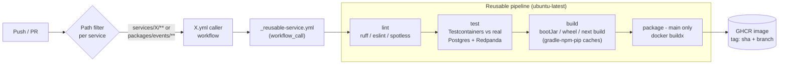

# Repository Structure & DevOps

## 1. Monorepo Layout

One repo, one clone, one `docker compose up` — the whole civilization is a vertical slice. Polyglot services live side by side; the shared contract (`packages/events`) sits at the top of the dependency graph and everything else consumes generated types from it.

```text
Minecraft-AI-Project/
├── apps/
│   └── dashboard/                        # Next.js 14 App Router, TS, Tailwind
│       ├── src/
│       │   ├── app/                      # routes: overview, villagers, government, laws,
│       │   │                             #   events, factions, relationships, timeline, analytics
│       │   ├── components/
│       │   ├── lib/                      # REST client (React Query), WS client
│       │   └── stores/                   # Zustand stores for live WS state
│       ├── e2e/                          # Playwright specs
│       └── package.json
│
├── services/
│   ├── minecraft-service/                # TypeScript / Node 22 — Mineflayer bot host
│   │   ├── src/
│   │   │   ├── bots/                     # bot lifecycle, per-villager session registry
│   │   │   ├── actions/                  # ActionRequested handlers: move, gather, chat, look
│   │   │   ├── observers/                # Mineflayer events -> world.events envelopes
│   │   │   └── kafka/                    # consumer (commands.minecraft), producer (world.events)
│   │   ├── test/                         # Vitest
│   │   └── package.json
│   │
│   ├── agent-service/                    # Python 3.12, FastAPI, LangGraph
│   │   ├── src/agent_service/
│   │   │   ├── api/                      # FastAPI routers (villagers, goals, relationships)
│   │   │   ├── graph/                    # the LangGraph cognitive loop
│   │   │   │   ├── nodes/                # perceive.py, retrieve.py, deliberate.py, act.py, reflect.py
│   │   │   │   ├── state.py              # typed graph state (perception, memories, decision)
│   │   │   │   └── build.py              # graph assembly + checkpointer wiring
│   │   │   ├── llm/                      # provider port: openai_provider.py, ollama_provider.py,
│   │   │   │                             #   fake_provider.py (deterministic, for tests)
│   │   │   ├── domain/                   # villagers, villager_goals, relationships models
│   │   │   ├── repositories/             # SQLAlchemy repos (owns its logical DB only)
│   │   │   ├── events/                   # Kafka in/out using types generated from packages/events
│   │   │   └── settings.py               # pydantic-settings, fail-fast validation
│   │   ├── tests/                        # pytest, fake-LLM by default
│   │   └── pyproject.toml
│   │
│   ├── memory-service/                   # Python 3.12, FastAPI, pgvector
│   │   ├── src/memory_service/
│   │   │   ├── api/                      # store/retrieve/reflect endpoints
│   │   │   ├── retrieval/                # recency x importance x relevance scorer
│   │   │   ├── reflection/               # periodic summarisation jobs
│   │   │   ├── embeddings/               # embedding provider (OpenAI or Ollama)
│   │   │   └── repositories/             # memories table + vector index
│   │   └── tests/
│   │
│   ├── event-service/                    # Java 21, Spring Boot 3, Gradle — hexagonal layout
│   │   ├── src/main/java/ai/civ/eventservice/
│   │   │   ├── domain/                   # event-store model, pure (no framework imports)
│   │   │   ├── application/
│   │   │   │   ├── port/in/              # RecordEventUseCase, ReplayTimelineUseCase
│   │   │   │   ├── port/out/             # EventStorePort, SearchIndexPort
│   │   │   │   └── service/              # use-case implementations
│   │   │   ├── adapter/
│   │   │   │   ├── in/rest/              # timeline + replay controllers
│   │   │   │   ├── in/kafka/             # consumes ALL topics (world, agent, social, government)
│   │   │   │   ├── out/persistence/      # JPA event store: events (append-only)
│   │   │   │   └── out/opensearch/       # full-text index writer
│   │   │   └── config/
│   │   ├── src/test/java/                # JUnit 5 + Mockito + Testcontainers
│   │   └── build.gradle.kts
│   │
│   ├── government-service/               # Java 21, Spring Boot 3 — schema now, code in P2-P4
│   ├── analytics-service/                # Java 21, Spring Boot 3 — projections, episodes, clips (from M1)
│   └── dashboard-service/                # Java 21, Spring Boot 3 (MVC + WebSocket) — BFF + WS fan-out (from M1/M2;
│                                         #   Sprint 1 live feed is an SSE endpoint on event-service instead)
│
├── packages/
│   ├── events/                           # SINGLE SOURCE OF TRUTH for event contracts
│   │   ├── schemas/
│   │   │   ├── envelope.schema.json      # eventId, eventType, schemaVersion, correlationId...
│   │   │   ├── world/                    # VillagerMoved.v1.schema.json, ResourceGathered.v1.schema.json...
│   │   │   ├── agent/                    # DecisionMade.v1.schema.json, GoalChanged.v1.schema.json...
│   │   │   ├── social/                   # VillagerTalked.v1.schema.json, RelationshipChanged.v1.schema.json...
│   │   │   ├── government/               # ElectionStarted.v1.schema.json, VoteCast.v1.schema.json...
│   │   │   └── commands/                 # ActionRequested.v1.schema.json
│   │   ├── codegen/                      # json-schema-to-typescript (TS), datamodel-code-generator (py) — `task gen`.
│   │   │                                 #   NO Java codegen until P2: event-service is schema-agnostic by design
│   │   │                                 #   (typed envelope columns + JSONB payload, generic JSON Schema validation);
│   │   │                                 #   jsonschema2pojo arrives with government-service, the first Java service
│   │   │                                 #   that deserializes payloads into typed classes
│   │   └── generated/                    # committed output, one dir per language
│   │       ├── ts/   └── py/             #   (java/ from P2)
│   ├── shared-ts/                        # Kafka wrapper, envelope builder, JSON logger (correlationId)
│   └── shared-py/                        # same for Python: envelope, logging middleware
│
├── infrastructure/
│   ├── docker/
│   │   ├── docker-compose.yml            # profiles: infra, app, minecraft
│   │   └── postgres-init/                # create logical DBs (agent, memory, event, government,
│   │                                     #   analytics) + CREATE EXTENSION vector
│   ├── prometheus/  grafana/  loki/  promtail/   # provisioned config + dashboards as code
│   ├── opensearch/
│   └── minecraft/                        # server.properties, paper-global.yml (containerized path)
│
├── experiments/                          # ARCHIVED proofs-of-concept — kept for history/YouTube,
│   ├── lookAt-Bot/                       #   excluded from CI and workspaces; README notes what
│   └── pathfinder-Bot/                   #   each proved (mineflayer 4.37.1 vs vanilla 1.21.6)
│
├── .github/workflows/
│   ├── _reusable-service.yml             # shared lint->test->build->package pipeline
│   ├── agent-service.yml ... dashboard.yml   # thin, path-filtered callers (one per deployable)
│   └── events-contracts.yml              # schema lint + cross-service contract tests
│
├── Taskfile.yml                          # cross-platform task runner (see §4)
├── .env.example                          # the ONLY config template; .env is gitignored
├── .gitignore
└── README.md
```

The two existing PoCs (`lookAt-Bot`, `pathfinder-Bot`) move into `experiments/` on day one with a short README each — they are the empirical proof that mineflayer 4.37.1 + minecraft-data 3.111 works against the user's 1.21.6 server, which directly informs the version pin in §3. They are never built by CI. (Note: the PoCs currently use caret ranges `^4.37.1` — when archiving them, record the exact resolved versions from their lockfiles, because those are the empirically-proven pair.)

## 2. Docker Compose Design

One `docker-compose.yml` with **three profiles** (Compose profiles = composable local environments; the interview concept here is *dev/prod parity* from 12-factor):

- **`infra`** — everything stateful/third-party. Started once, left running all day.
- **`app`** — the 7 services + dashboard, built from local Dockerfiles. Used for "full demo" runs; during feature work you run only the service you're editing on the host (see §4).
- **`minecraft`** — optional containerized PaperMC. Off by default because a working host server already exists.

All `depends_on` entries use `condition: service_healthy` — startup ordering is orchestrated by healthchecks, not sleeps.

### Infra profile

| Service | Image | Ports (host) | Healthcheck | depends_on |
|---|---|---|---|---|
| redpanda | `redpandadata/redpanda:v24.2` (started with `--smp 1 --memory 1G --mode dev-container` and `--set redpanda.auto_create_topics_enabled=false` — a producer that beats topic provisioning fails loud instead of silently auto-creating a 1-partition topic; topics are provisioned by `scripts/provision-topics.mjs` inside `task up`; container capped at `mem_limit: 1536m`) | 9092, 9644 | `rpk cluster health` | — |
| redpanda-console | `redpandadata/console:v2.7` | 8085→8080 | `GET /admin/health` | redpanda |
| postgres | `pgvector/pgvector:pg16` (tuned via `command:` flags — `shared_buffers=512MB`, `effective_cache_size=1536MB`, `work_mem=16MB`, `maintenance_work_mem=128MB` — sized for its `mem_limit: 2g`, because one instance hosts all five logical DBs and HNSW search, ledger appends, and relationship writes share its page cache) | 5432 | `pg_isready -U civ` | — |
| redis | `redis:7-alpine` | 6379 | `redis-cli ping` | — |
| opensearch *(M2+ — commented out until the timeline search milestone)* | `opensearchproject/opensearch:2.17` (single-node, `OPENSEARCH_JAVA_OPTS=-Xms512m -Xmx512m`, security plugin disabled locally) | 9200 | `curl -f localhost:9200/_cluster/health` | — |
| prometheus | `prom/prometheus:v2.54` | 9090 | `GET /-/healthy` | — |
| grafana | `grafana/grafana:11.2` | 3001→3000 (3000 is reserved for Next.js) | `GET /api/health` | prometheus |
| loki *(M1+ — until 20 villagers make `docker compose logs \| grep <correlationId>` painful, grep over structured JSON logs gives the identical trace demo for zero infra)* | `grafana/loki:3.1` | 3100 | `GET /ready` | — |
| promtail *(M1+, with loki)* | `grafana/promtail:3.1` | — | none (ships Docker container logs to loki) | loki |

Image tags above name the minor line; the compose file pins **full patch tags** (e.g. the exact `v24.2.x` current at scaffold time) — the same "never LATEST, never floating" discipline as `MC_VERSION`, for every image.

### App profile

| Service | Image | Ports (host) | Healthcheck | depends_on |
|---|---|---|---|---|
| minecraft-service | local build (`node:22-slim`) | 8003 (health/metrics only) | `GET /healthz` | redpanda, redis |
| agent-service | local build (`python:3.12-slim`) | 8001 | `GET /healthz` | redpanda, postgres, redis (+ memory-service once extracted at M1) |
| memory-service *(extracted from agent-service in Sprint 2 — the bounded context existed from day one as an in-process module; the network hop arrived once the contract was proven)* | local build (`python:3.12-slim`) | 8002 | `GET /healthz` | postgres |
| event-service | local build (`eclipse-temurin:21-jre`) | 8081 | `GET /actuator/health` | redpanda, postgres — OpenSearch is an optional, feature-flagged adapter (M2+), never a startup dependency |
| government-service *(from M2 — entry does not exist in compose until then)* | local build (temurin 21) | 8082 | `GET /actuator/health` | redpanda, postgres |
| analytics-service *(from M1)* | local build (temurin 21) | 8083 | `GET /actuator/health` | redpanda, postgres |
| dashboard-service *(from M1/M2 — Sprint 1 uses event-service SSE)* | local build (temurin 21, MVC + WS) | 8080 | `GET /actuator/health` | redpanda |
| dashboard | local build (`node:22-slim`, `next start`) | 3000 | `GET /` | event-service (Sprint 1) → dashboard-service (M1+) |

Ports follow the canonical table in the API design doc: Java services on `808x`, Python/Node services on `800x`, the browser-facing Next.js app alone on `3000`.

**Compose rule, enforced in PR review:** a service appears in docker-compose.yml in the same PR that gives it its first real feature — never before. An empty Spring Boot stub is ~400 MB of JVM doing nothing.

### Minecraft profile

| Service | Image | Ports | Healthcheck | depends_on |
|---|---|---|---|---|
| minecraft | `itzg/minecraft-server` with `TYPE=PAPER`, `VERSION=${MC_VERSION}`, `ONLINE_MODE=FALSE`, `MEMORY=3G` (JVM heap; the container carries a compose `mem_limit: 4g` — heap plus JVM/native overhead — so a Paper leak can't starve the rest of the stack) | 25565 | built-in `mc-health` | — |

**Host-server vs container:** `minecraft-service` resolves its target purely from env: `MC_HOST` / `MC_PORT`. Default in `.env.example` is `MC_HOST=host.docker.internal`, `MC_PORT=25565` — i.e., the user's existing host-run 1.21.6 vanilla server, with the `minecraft` profile left off. Switching to the containerized PaperMC is `MC_HOST=minecraft` plus `--profile minecraft`. PaperMC is recommended for the containerized path because it handles 20+ concurrent connections with far better tick performance than vanilla, and `itzg/minecraft-server` gives declarative, version-pinned, restartable server config.

### Honest RAM budget (Docker Desktop / WSL2 VM)

| Group | Estimate |
|---|---|
| Infra profile, P1 shape (Redpanda 1G capped, Postgres 0.4, Prometheus/Grafana ~0.5, Redis/Console ~0.2 — no OpenSearch, no Loki until their milestones) | ~2–2.5 GB |
| App profile, P1 shape (event-service JVM `-Xmx256m` ≈ 0.5; agent-service with in-process memory module ≈ 0.4; minecraft-service ≈ 0.3–0.5 with `viewDistance: 'tiny'`; Next.js ≈ 0.3) | ~1.5–2 GB |
| Full M2+ stack (add OpenSearch 1.2G, Loki/Promtail 0.4, 3 more JVMs ~1.5, memory-service 0.2) | +~3.5 GB |
| Containerized PaperMC (20 bots loading chunks) | ~3.5 GB |

**This box is a verified 32 GB / RTX 4090 machine — everything fits, including Ollama on the GPU.** Still write a `~/.wslconfig` cap (`memory=16GB`, `swap=8GB`) so Docker/WSL2 can never starve the host Minecraft server + OBS during a filming session — that's the outer bound; inside the VM, the three biggest containers carry their own compose `mem_limit`s (postgres 2g, redpanda 1536m, minecraft 4g — added in PR #37; see `docs/reports/bottleneck-report-2026-07-17.md`), so none of the heavyweights can starve the rest of the stack either (the lighter services remain uncapped). The two levers that matter regardless of RAM: (1) every `createBot` call sets `viewDistance: 'tiny'` — bots navigate by pathfinder, not by seeing far, and default view distance is where a naive 20-bot deployment burns 1.5 GB; (2) set `view-distance=4` and `simulation-distance=4` in the server's `server.properties` — 20 connections at the default 10 forces the single-threaded server to load ~440 chunks per player, which is what would actually lag the film shoot (and is also the argument for moving to the Paper container at M1).

## 3. Version Pinning — the #1 Breakage Risk

`MC_VERSION` lives **once**, in the root `.env`, and is read by both the `itzg/minecraft-server` container (`VERSION=${MC_VERSION}`) and `minecraft-service` (passed as the `version` option to every `mineflayer.createBot`). Pin it to **1.21.6** — the newest version empirically validated by the two working PoCs (mineflayer 4.37.1 + minecraft-data 3.111 against the live 1.21.6 server) and listed as supported by mineflayer.

This is the project's number-one breakage risk, so it deserves a paragraph: mineflayer is a clean-room reimplementation of the Minecraft network protocol, and Mojang changes that protocol with essentially every release; mineflayer/minecraft-data support typically lags a new Minecraft version by weeks to months. If the server version drifts ahead of the library — most insidiously via `VERSION=LATEST` on the itzg image silently auto-upgrading on container recreate — all 20 bots fail to log in at once and the whole civilization goes dark with cryptic protocol-deserialization errors. Therefore: never `LATEST`, always an exact pin; `package.json` pins mineflayer exactly (no `^`) and lets mineflayer's own transitive `minecraft-data` resolve via the lockfile (pinning both independently risks a mismatched pair — only add a direct minecraft-data dependency if code actually imports it, and then at the version mineflayer's lockfile chose); upgrades happen deliberately as one atomic PR that bumps `MC_VERSION` and `mineflayer` together, gated by `task smoke` (one bot connects, walks 10 blocks, chats, disconnects) before merge. Interview concept: **reproducible builds / explicit dependency pinning at a system boundary you don't control**.

## 4. Developer Workflow

**Task runner: Taskfile (go-task).** Justification for a Windows host: `make` isn't native on Windows; npm scripts would work but this is a polyglot repo (Gradle/pip/npm) where every script would just be shell-outs — and PowerShell vs bash quoting differences make those scripts fragile. Task is a single binary (`winget install Task.Task`), and critically it **embeds its own POSIX shell interpreter**, so the exact same task runs identically in PowerShell, Git Bash, and CI. It also gives dependency graphs between tasks, `dotenv:` loading of the root `.env`, and namespaced includes per service. (npm scripts remain inside each Node package for package-local concerns; Taskfile is the cross-repo orchestrator.)

Setup is two commands: `cp .env.example .env` (fill in `OPENAI_API_KEY` or leave blank for Ollama), then `task up`.

| Task | What it does |
|---|---|
| `task up` | `docker compose --profile infra up -d --wait` — infra only, healthcheck-gated — then provisions the Kafka topic map (`scripts/provision-topics.mjs`) |
| `task up:all` | infra, then topics, then the app profile (add `MC=container` to include the `minecraft` profile) |
| `task topics` | provision the Kafka topic map on its own — broker auto-create is disabled, so provisioning must precede any producer on a fresh cluster (partition changes go through `docs/runbooks/kafka-topic-migration.md`) |
| `task dev` | infra in Docker; prints per-service hot-reload commands (`uvicorn --reload`, `gradle bootRun`, `tsx watch`, `next dev`) and starts the ones you name: `task dev -- agent-service dashboard` |
| `task gen` | regenerate TS/Python/Java types from `packages/events/schemas` (fails CI if output is dirty — drift guard) |
| `task seed` | create the 20 named villagers with personalities/goals via agent-service's seed endpoint |
| `task demo` | `up:all` + `seed` + open `http://localhost:3000` — the end-of-sprint vertical-slice demo, one command |
| `task smoke` | one throwaway bot connects to `MC_HOST:MC_PORT`, walks, chats — the version-pin canary |
| `task test` / `task test:<service>` | run all or one service's test suite |
| `task logs` | `docker compose logs -f --tail=100` |
| `task down` / `task nuke` | stop everything / stop and delete volumes (fresh world) |

## 5. GitHub Actions CI

**Pattern: thin path-filtered caller workflows + one shared reusable workflow** (`workflow_call`). Each deployable gets a ~15-line workflow whose `on.push.paths` covers its own directory **plus** `packages/events/**` and its shared package — so a schema change rebuilds every consumer, but a change to `analytics-service` never runs `agent-service` tests. Interview concepts on display: **monorepo change detection (path filtering), DRY CI (reusable workflows), matrix builds, and dependency caching**.

```yaml
# .github/workflows/agent-service.yml (caller — every service looks like this)
on:
  push: { paths: ['services/agent-service/**', 'packages/events/**', 'packages/shared-py/**'] }
  pull_request: { paths: [ ...same... ] }
jobs:
  ci:
    uses: ./.github/workflows/_reusable-service.yml
    with: { service: agent-service, language: python }
    secrets: inherit
```

The reusable workflow runs four sequential jobs, all on `ubuntu-latest` — GitHub-hosted Linux runners ship with a working Docker daemon, which is exactly what **Testcontainers** needs (spin up real Postgres+pgvector and Redpanda per test run; never mock the database). Windows runners are avoided entirely: they can't run the Linux containers Testcontainers requires. Keep the repo **public** — it's a portfolio, and public repos get 4-core/16 GB runners vs 2-core/7 GB for private, which is the difference between Testcontainers suites passing in minutes and timing out. Locally on Windows, enable `testcontainers.reuse.enable=true` so evening test runs don't pay container startup every time.

1. **lint** — ruff+mypy / eslint+tsc / spotless+checkstyle, per `language` input.
2. **test** — pytest (fake-LLM provider, no API key in CI) / Vitest / JUnit 5 + Testcontainers. Coverage is **report-only during M0** (a hard gate on a walking skeleton breeds test theater); the ≥80% gate is enforced from M1 on the paths the Definition of Done names. Contract tests validate all consumed/produced events against `packages/events` schemas.
3. **build** — wheel / `next build` / `gradle bootJar`, with `actions/setup-*` caches (Gradle wrapper + dependency cache, npm cache, pip cache) keyed on lockfiles.
4. **package** *(main branch only)* — `docker buildx` with registry layer cache, push to GHCR tagged `sha-<shortsha>` and branch name; `latest` only from main. Sha tags mean **immutable, traceable artifacts** — any running container maps to exactly one commit.

A separate `events-contracts.yml` lints every JSON Schema, checks `schemaVersion` is only ever incremented (no in-place edits to a published version), and verifies `task gen` output is committed and clean.



## 6. Configuration Strategy

Classic **12-factor config**: behavior comes from env vars, with sensible defaults baked into each service so a fresh clone runs with near-zero setup.

- **One shared `.env`** at the repo root (gitignored), created from the committed `.env.example`. It holds only cross-cutting values: `MC_VERSION`, `MC_HOST`, `MC_PORT`, `KAFKA_BROKERS`, `POSTGRES_*`, `REDIS_URL`, `OPENSEARCH_URL`, `LLM_PROVIDER`, `OPENAI_API_KEY`, `OLLAMA_BASE_URL`, `LOG_LEVEL`. Both `docker-compose.yml` (`env_file`) and `Taskfile.yml` (`dotenv:`) load it, so containerized and host-run services see identical config.
- **Per-service defaults** live where each stack expects them: Spring `application.yml` with `${VAR:default}` placeholders; Python `settings.py` using pydantic-settings (typed, **fail-fast at boot** on invalid config rather than at first use); a zod-validated `config.ts` in the Node services. Precedence everywhere: process env > root `.env` > in-repo default.
- **Secrets are never committed.** `.env` is gitignored; `.env.example` contains placeholder values only; a CI check greps for accidental key material. In GitHub Actions, secrets come from repository Secrets, and GHCR pushes authenticate with the ephemeral `GITHUB_TOKEN` — no PAT to leak.
- **`OPENAI_API_KEY` is optional by design.** `LLM_PROVIDER` defaults to `openai`; if the key is absent at boot, agent-service and memory-service log a single structured warning and fall back to `ollama` at `OLLAMA_BASE_URL` (default `http://host.docker.internal:11434`, since Ollama runs on the Windows host for GPU access). Tests always use the `fake` provider — CI never spends a token.

```dotenv
# .env.example (excerpt)
MC_VERSION=1.21.6            # THE pin — see §3; change only via the atomic upgrade PR
MC_HOST=host.docker.internal # existing host server; set to 'minecraft' for the container
MC_PORT=25565
KAFKA_BROKERS=redpanda:9092
LLM_PROVIDER=openai          # openai | ollama | fake
OPENAI_API_KEY=              # optional — blank means fall back to Ollama
OLLAMA_BASE_URL=http://host.docker.internal:11434
```
