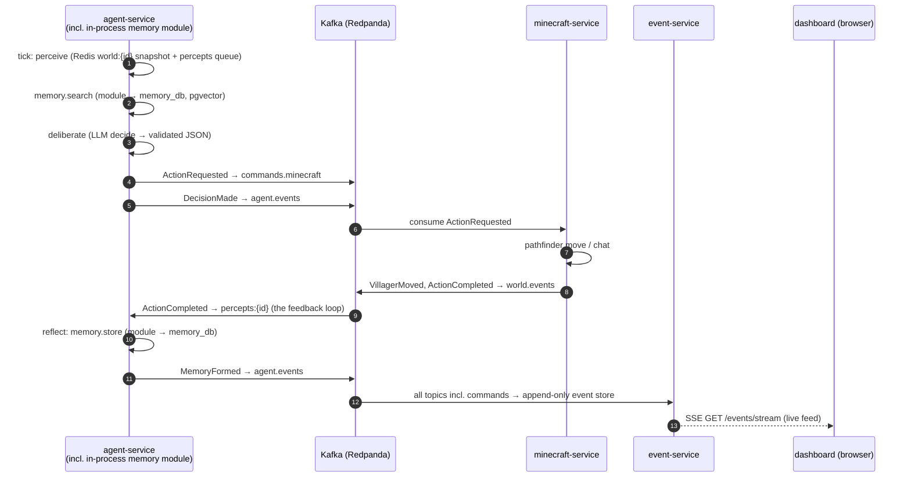
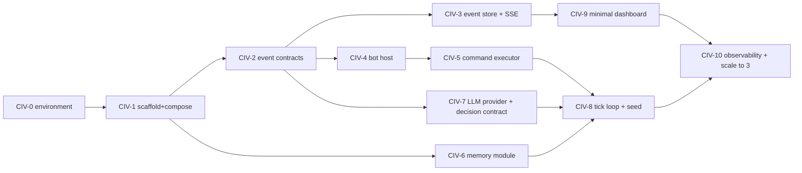

# MVP Roadmap & Sprint 1 Plan

## 1. Milestone Roadmap

Durations assume a solo developer working evenings/weekends (~8–12 focused hours/week). Every milestone ends with something you can film — the YouTube series and the architecture roadmap are the same roadmap.

| Milestone | Goal | Key Deliverables | Demo Checkpoint ("what you can film") | Duration | YouTube Hook |
|---|---|---|---|---|---|
| **M0 — Foundations** (Sprints 1–2) | Walking skeleton: ONE villager end-to-end through every architectural layer, then config-scale to 3 | Environment bring-up (Docker Desktop, WSL2 config, Ollama models); monorepo + Compose infra (Postgres/pgvector, Redis, Redpanda, Prometheus/Grafana); `packages/events` envelope + first 8 schemas + TS/Python codegen; event-service ingest + `GET /events` + SSE live stream; minecraft-service bot host + command executor; agent-service LangGraph tick loop with in-process memory module + LLM provider chain (openai→ollama→fake); minimal Next.js page; CI skeleton (Sprint 2) | 3 named villagers spawn, wander, and chat in-game while the dashboard shows a live event feed; Grafana shows decision latency + token cost in real time | 4–6 weeks | *Episode 0 dev-log: "The First AI Villager Wakes Up"* |
| **M1 — MVP (P1)** | 20 villagers with names, personalities, goals, and relationships that talk, move, gather resources, and remember | Extract memory-service to its own deployable; asyncio tick scheduler with per-villager staggering; gather actions (chop/mine/collect); conversation loop (`ChatObserved` → percepts for listeners → `VillagerTalked`, `RelationshipChanged`); reflection summaries; analytics-service v0 (popular/hated leaderboard, episode report stub); dashboard-service BFF + WS; Loki/Promtail; coverage gate enforced; dashboard pages: Overview, Villagers, Events, Relationships; k6 baseline; move to containerized PaperMC | A full in-game day: 20 villagers gathering wood, pairing off to chat, forming friendships and grudges visible on a live relationship graph | 6 weeks | *"20 AI Villagers Wake Up"* — first flagship episode |
| **M2 — Government (P2)** | Villagers hold an election and elect a mayor who issues directives | government-service (elections, candidates, votes); `ElectionStarted`/`CandidateNominated`/`VoteCast`/`ElectionDecided` events; campaign behavior in agent-service (candidates give speeches, villagers vote from memories + relationships); approval-rating projections; dashboard Government page; OpenSearch timeline indexing + full-text search (replacing P1's Postgres FTS); Java codegen leg for government-service | Election night: candidates campaign in chat, live vote tally streams onto the dashboard, mayor announced in-game and issues a first directive | 6 weeks | **The title episode:** *"I Made 20 AI Villagers Form Their Own Government"* |
| **M3 — Laws (P3)** | Mayor passes laws; villagers obey, violate, and get punished | `laws` domain in government-service; `LawProposed`/`LawEnacted` lifecycle + `LawBroken` detection (rules engine over world/social events); obedience as a personality-weighted agent input; punishment actions; lawful/chaotic leaderboards; clip markers for violations | The first crime: a law is passed on camera, a chaotic villager breaks it, the violation is detected from the event stream and punished — with the timeline replay to prove it | 4–5 weeks | *"My AI Villagers Wrote Their Own Laws — Then One Broke Them"* |
| **M4 — Factions (P4)** | Factions, parties, betrayals, and the first rebellion | `factions`/`faction_members`; faction formation from relationship clusters; `FactionCreated`/`BetrayalRecorded`; faction rankings + influence leaderboard; episode reports + clip markers mature into an editing pipeline; dashboard Factions page | Timeline replay of a rebellion: faction forms, loyalty erodes, a betrayal event fires, villagers march on the mayor | 6 weeks | *"The AI Villagers Split Into Factions and Started a Rebellion"* |
| **M5 — Civilization (P5)** | Economy, trade, disasters, religion, wars; scale to 100+ villagers, multiple civilizations/servers | Multi-bot sharding in minecraft-service; Avro + Schema Registry migration; viewer-interaction API; YouTube/Discord integrations; economy + trade events; cross-civilization diplomacy/war | Two civilizations trading, then going to war — 100-villager time-lapse with a war-room dashboard | 10–12 weeks, then ongoing | *"100 AI Villagers, Two Civilizations, One War"* |

> **Interview concept:** the roadmap is a sequence of vertical slices — every milestone is independently demoable via `docker compose up`, never a horizontal "build all the databases first" phase.

---

## 2. Sprint 1 — The Walking Skeleton

**Goal:** ONE villager, end-to-end, through *every* layer of the architecture — then prove horizontal scale by bumping a config value to 3.

**Honest capacity note (from the design review):** the first draft of this sprint packed ~100 hours of tickets into a 2-week/20-hour window — 4–6× oversubscribed. This version is the true skeleton: 11 tickets, ~30–35 hours, ~3 calendar weeks solo. Everything cut (CI, dashboard-service, Loki, memory-service as a network service, OpenSearch) lands in Sprint 2 or its named milestone. The filmable demo is unchanged.

The skeleton trace, which is also the demo and also the correlation-ID exercise:

**Sprint success statement (filmable):** a villager named e.g. *Elara* spawns on the local 1.21.6 server, an LLM decides "walk to the oak tree and greet anyone nearby," she pathfinds there and chats, *the completion of that action comes back to her as a percept and becomes a memory*, every event lands in the event store with a shared `correlationId`, and the browser shows it live within 2 seconds. Then `VILLAGER_COUNT=3` and it all still works with per-villager event ordering intact.

**Why walking skeleton:** the riskiest thing in this system is not any one service — it is the *integration seams* (Kafka envelope discipline, cross-language contracts, the LLM-output→command contract, Mineflayer ↔ agent latency). The skeleton retires all seam risk first, so M1 is pure feature work.

### Ticket dependency chain

Week 1: CIV-0 → CIV-3 (environment, infra, contracts, event store). Week 2: CIV-4 → CIV-7 (bot, executor, memory, LLM). Week 3: CIV-8 → CIV-10 (brain, UI, demo).

---

## 3. Sprint 1 Ticket Breakdown

Estimates: **S** = 1–2 evenings (~2–4h), **M** = ~a week of evenings (~6–10h), **L** = a weekend-plus (~10–16h).

| ID | Title | Service | Description | Acceptance Criteria | Depends on | Est |
|---|---|---|---|---|---|---|
| CIV-0 | Environment bring-up | host machine | Make the assumed environment real (design review verified: Docker Desktop not installed, Ollama running with zero models, 32 GB/RTX 4090 available). | • Docker Desktop installed, WSL2 integration on; `~/.wslconfig` written with `memory=16GB`, `swap=8GB` • `ollama pull llama3.1:8b` + `ollama pull nomic-embed-text`; `/api/tags` lists both • Host server tuned for 20 future bots: `view-distance=4`, `simulation-distance=4` in server.properties • PoCs archived to `experiments/` with exact resolved mineflayer/minecraft-data versions recorded from their lockfiles • Smoke: PoC bot still connects to the 1.21.6 server after all changes | — | S |
| CIV-1 | Monorepo scaffold + Compose infra | infrastructure | Create `apps/`, `services/`, `packages/`, `infrastructure/` layout; Compose infra profile. | • `docker compose --profile infra up -d --wait` from a clean clone starts Postgres 16+pgvector, Redis, Redpanda, Prometheus, Grafana — all healthchecks green (no OpenSearch, no Loki — those arrive at their milestones) • Init script creates all five logical DBs + roles and `CREATE EXTENSION vector` in `memory_db` (superuser context) • All images pinned to full patch tags • README quickstart + `.env.example` covering all required config | CIV-0 | M |
| CIV-2 | Event contracts + codegen (TS/Py) | packages/events | JSON Schema envelope + first 8 event types + the WorldSnapshot state contract. | • `envelope.schema.json` enforces all envelope fields (eventId UUIDv7, eventType PascalCase, schemaVersion, occurredAt ISO-8601 UTC, source, aggregateType, aggregateId, correlationId, causationId, payload) • 8 payload schemas: `ActionRequested` (action enum incl. `spawn`/`despawn`), `ActionCompleted`, `ActionFailed`, `VillagerSpawned`, `VillagerMoved`, `ChatObserved`, `DecisionMade`, `MemoryFormed` — each with a valid fixture • `state/WorldSnapshot.v1.schema.json` (position, health, inventory summary, nearbyVillagers[{villagerId,name,distance}], timeOfDay) • `task gen` emits TS interfaces + Pydantic models (Java codegen deferred to P2 — event-service is schema-agnostic) • Contract test script: every fixture validates; a deliberately broken fixture fails | CIV-1 | M |
| CIV-3 | Event store ingest + read API + SSE | event-service | The ledger: consume everything, persist append-only, expose reads + live stream. | • Subscribes to `world.events`, `agent.events`, `social.events`, **and `commands.minecraft`** (commands are archived for causation chains — never acted on; minecraft-service remains the only executor) • **Idempotent consumer**: `INSERT ... ON CONFLICT (event_id) DO NOTHING`; redelivery inserts zero duplicates • `GET /events?type&aggregate-id&since&until&cursor&limit` cursor-paged, ordered by `occurredAt` • `GET /events/stream` — SSE endpoint (Spring MVC `SseEmitter`, ~30 lines) relaying live envelopes; this is Sprint 1's "dashboard-service" • Consumer lag exposed as a Micrometer/Prometheus metric • Testcontainers (Redpanda + Postgres) test: publish → row appears with all envelope fields intact | CIV-2 | M |
| CIV-4 | Bot host + world bridge | minecraft-service | Mineflayer bot sessions and world observation. | • `ActionRequested{action:"spawn", params:{villagerId, minecraftUsername, spawnPosition}}` creates a BotSession that joins the 1.21.6 server and emits `VillagerSpawned`; `despawn` tears it down • Every `createBot` sets `viewDistance: 'tiny'` (bots navigate by pathfinder, not by sight) • Redis roster hash `mc:roster` (username → villagerId) populated on spawn, consulted by every observer • `WorldSnapshot` written to Redis `world:{villagerId}` every 1s, validated against the schema in tests • `ChatObserved` emitted with self-filter (a bot never observes its own utterance — prevents the echo loop) and `heardByIds` resolved via the roster • `VillagerMoved` throttled: ≤1 per 5s while moving, plus one on path completion • Auto-reconnect with exponential backoff; Vitest unit tests on event mapping with a mocked bot | CIV-2 | M |
| CIV-5 | Command executor (CQRS command side) | minecraft-service | Consume `commands.minecraft` and act in-world. | • `ActionRequested{action:"move"}` pathfinds via mineflayer-pathfinder; `{action:"chat"}` sends chat (enum values from the schema; `gather`/`follow`/`idle` may stub to `ActionFailed{errorCode:"NOT_IMPLEMENTED"}` in Sprint 1) • Emits `ActionCompleted`/`ActionFailed` with `causationId` = triggering command's `eventId` (causation chain intact) • **Timeout watchdog**: a command that hasn't terminated within its `timeoutMs` emits `ActionFailed{errorCode:"TIMEOUT"}` — the "every command terminates in exactly one outcome" invariant holds through crashes • Redis `commandId` dedupe with TTL: redelivered commands never execute twice • Unknown/invalid action → `ActionFailed`, process stays alive | CIV-4 | M |
| CIV-6 | Memory module (in-process, own DB) | agent-service | The Memory bounded context as a `memory/` package over `memory_db` — extraction to a standalone service is M1's first ticket. | • `store()` persists text, embedding, importance, sentiment to `memory_db` (heuristic importance/sentiment in Sprint 1; never a separate LLM scoring call) • `search()` ranks top-k by weighted recency × importance × relevance (pgvector cosine) • Embeddings via provider abstraction: `nomic-embed-text` (Ollama) or `text-embedding-3-small@768` (OpenAI), recorded per-row in `embedding_model` • Module interface mirrors the future REST contract exactly (store/search/reflect) • pytest with fake embedding provider runs offline; one integration test against real pgvector; p95 retrieval latency metric | CIV-1 | M |
| CIV-7 | LLM provider chain + decision contract | agent-service | Ports-and-adapters for LLMs, and the single most failure-prone seam: LLM output → command. | • `LLMProvider` port with `OpenAIProvider`, `OllamaProvider`, deterministic `FakeProvider`; fallback chain `openai → ollama → fake` with a **boot-time reachability probe** (blank API key + Ollama tag list must contain the configured model, else log one structured warning and degrade — the demo never crashes on missing credentials) • Decision output is JSON validated against the `ActionRequested` params schema (OpenAI structured outputs / Ollama JSON mode; FakeProvider returns canned valid instances) • Malformed LLM response → `DecisionMade{error:true}`, action falls back to `idle`, Prometheus counter increments — the tick loop never dies • Every call records tokens, cost estimate, latency as Prometheus metrics • **Daily token budget circuit breaker**: hitting `LLM_DAILY_TOKEN_BUDGET` flips the provider to `fake` and fires an alert • Full pytest suite passes offline with `FakeProvider` | CIV-2 | M |
| CIV-8 | LangGraph tick loop + seed + feedback loop | agent-service | The villager brain — including the percept feedback that makes memory real. | • LangGraph graph: perceive → retrieve → deliberate → act → reflect • Perceive reads the Redis `world:{id}` snapshot **and drains a `percepts:{villagerId}` Redis list** • A `world.events` consumer (group `agent-service.perception`) filters `ActionCompleted`/`ActionFailed` for own villagers onto their percept queues — Elara *remembers she reached the oak tree* • `TICK_INTERVAL_SECONDS` first-class config, default 60; villager *i* offset by `i × interval/N`; in-process asyncio scheduler with per-villager in-flight guard (no distributed locks — one process) • `POST /internal/seed` reads committed `seed/villagers.json` (3 personas now; all 20 authored for M1), inserts rows, emits `VillagerCreated`, publishes `spawn` commands • Per tick emits `DecisionMade` (+ `VillagerTalked` when speaking), stores a memory via the module, emits `MemoryFormed`; fresh `correlationId` propagated into every downstream event • Compose E2E with `FakeProvider`: villager visibly walks and chats in-game within one tick | CIV-5, CIV-6, CIV-7 | L |
| CIV-9 | Minimal dashboard | apps/dashboard | Next.js Overview page: villager list + live feed — no BFF yet. | • Villager cards (name, personality, current goal) via React Query; `next.config.js` rewrites proxy `/api/*` to agent-service and event-service (single origin, no CORS) • Live event feed via native `EventSource` on event-service's SSE endpoint; new events render <2s after emission, color-coded by `eventType` • No Zustand/WS plumbing yet — that arrives with dashboard-service in M1/M2 | CIV-3 | S |
| CIV-10 | Observability + scale to 3 + demo script | all | Metrics, one dashboard, the filmable proof. | • All running services expose `/metrics`; Prometheus scrapes them • Grafana "Civilization Overview": event throughput, decision latency, LLM tokens + cost, memory retrieval latency, Kafka consumer lag • Structured JSON logs with `correlationId` everywhere; `docker compose logs \| grep <correlationId>` reconstructs one full decision across ≥3 services (Loki lands in M1) • `VILLAGER_COUNT=3`: three staggered tick loops, distinct personalities, per-villager event ordering verified from the event store • `docs/demo-sprint-1.md`: exact filmable run-through from clean clone to live dashboard | CIV-8, CIV-9 | M |

**Sprint 2 (completes M0):** CI skeleton (path-filtered workflows, Testcontainers on ubuntu-latest, coverage report-only), extract memory-service to its own deployable, `gather` action for real, contract-test job, backlog grooming for M1.

---

## 4. Sprint 1 Explicit NON-Goals

Written down so they can be enforced in PR review — the scope gate is part of the definition of the sprint.

- **No government, elections, laws, or factions** — schemas are designed in the data-model section, but zero government-service code is built or deployed.
- **No dashboard-service** — the live feed is event-service's SSE endpoint; the BFF earns its place at M1/M2 when there is something to aggregate.
- **No memory-service deployable** — the Memory context runs as an in-process module over its own `memory_db`; extraction is Sprint 2/M1.
- **No CI** — Sprint 2. (Contract tests exist as local scripts from CIV-2 onward.)
- **No OpenSearch** — Postgres FTS on the events table backs the timeline until M2 makes search a real feature.
- **No Loki/Promtail** — structured JSON logs + grep until 20 villagers make that painful (M1).
- **No auth** — everything is localhost; API auth arrives with viewer-interaction APIs (M5).
- **No multi-civilization / multi-server** — one MC server, one village.
- **No analytics-service** — the raw event feed is the Sprint 1 "analytics."
- **No relationship dynamics** — villagers may greet each other, but `RelationshipChanged` scoring logic is M1.
- **No Avro/Schema Registry, no Kubernetes, no cloud** — documented scale-up paths, not MVP work.

---

## 5. Definition of Done + Top Risks

### Sprint 1 Definition of Done

1. **One-command demo:** from a clean clone, `task up` + `task seed` produces the full 3-villager demo; the only manual prerequisites are CIV-0's checklist and the running local Minecraft server.
2. **All 11 tickets merged to `main`**, with contract fixtures validating in all shipped languages (TS + Python).
3. **Coverage measured and reported** on the core paths (event ingest/read, graph nodes, retrieval scoring); the 80% gate is enforced from M1 — report-only until then.
4. **Traceable:** a single `correlationId` can be followed via `docker compose logs | grep` from perceive → LLM decision → `ActionRequested` → in-game action → `ActionCompleted` → percept → memory → event store.
5. **Observable:** the Grafana "Civilization Overview" dashboard shows live, non-zero data for all five custom metric families during the demo.
6. **Filmed:** a 2–3 minute screen recording of the demo exists — Episode 0 b-roll, and the regression baseline for what "working" looks like.
7. **Scope gate held:** no merged code references government/faction concepts (checked in review).

### Top 5 Risks

| # | Risk | Impact | Mitigation |
|---|---|---|---|
| 1 | **LLM cost/latency at 20 agents** (M1). The math: ~2,000 tokens in / ~200 out per decision; at a 60s tick, 20 villagers = 20 decisions/min ≈ **$0.50/hour on gpt-4o-mini** — fine for a filming session, ruinous left running 24/7 (~$350/month). Local llama3.1-8b on the 4090 sustains ~20 serialized decisions/min — exactly at budget, zero headroom | Budget blowout; sluggish, unfilmable villagers | `TICK_INTERVAL_SECONDS=60` default with staggering (deliberate **backpressure** on the provider); `OLLAMA_NUM_PARALLEL=2` for headroom on the 24 GB GPU; importance/sentiment scoring folded into the deliberation output — never separate LLM calls; hard daily token budget with circuit-breaker to `FakeProvider`; token/cost panel on Grafana from day one |
| 2 | **Mineflayer / Minecraft version drift**: 1.21.6 support breaks on a library or server patch | The entire world bridge goes dark | Pin exact versions (server jar, mineflayer; minecraft-data via mineflayer's lockfile); isolate all protocol-touching code inside minecraft-service (**anti-corruption layer**); `task smoke` as the canary; upgrades as one atomic PR |
| 3 | **The LLM-output→command seam misbehaves**: malformed JSON, hallucinated actions, prompt drift | Tick loops crash or villagers freeze mid-episode | Decision output schema-validated against `ActionRequested` params (CIV-7); malformed → `idle` + metric, never a crash; `FakeProvider` E2E tests exercise the full seam deterministically in CI |
| 4 | **Windows Docker quirks**: WSL2 memory hunger, bind-mount I/O, container↔host networking to the MC server | Flaky infra eats evening dev sessions; a starved host lags the film shoot | `~/.wslconfig` cap written in CIV-0 (`memory=16GB`) so Docker never starves the host MC server + OBS; all data in named volumes; bots reach the host server via `host.docker.internal:25565`; healthcheck-gated `depends_on` |
| 5 | **Scope creep — wanting the drama too early**: elections and betrayals are the fun part | Walking skeleton never finishes; nothing is ever filmable | The NON-goals list is enforced in PR review; government/faction work is physically parked in designed-but-unbuilt schemas; the YouTube cadence is the forcing function — Episode 0 ships before the title episode starts; every "wouldn't it be cool if…" goes to the M2+ backlog |
